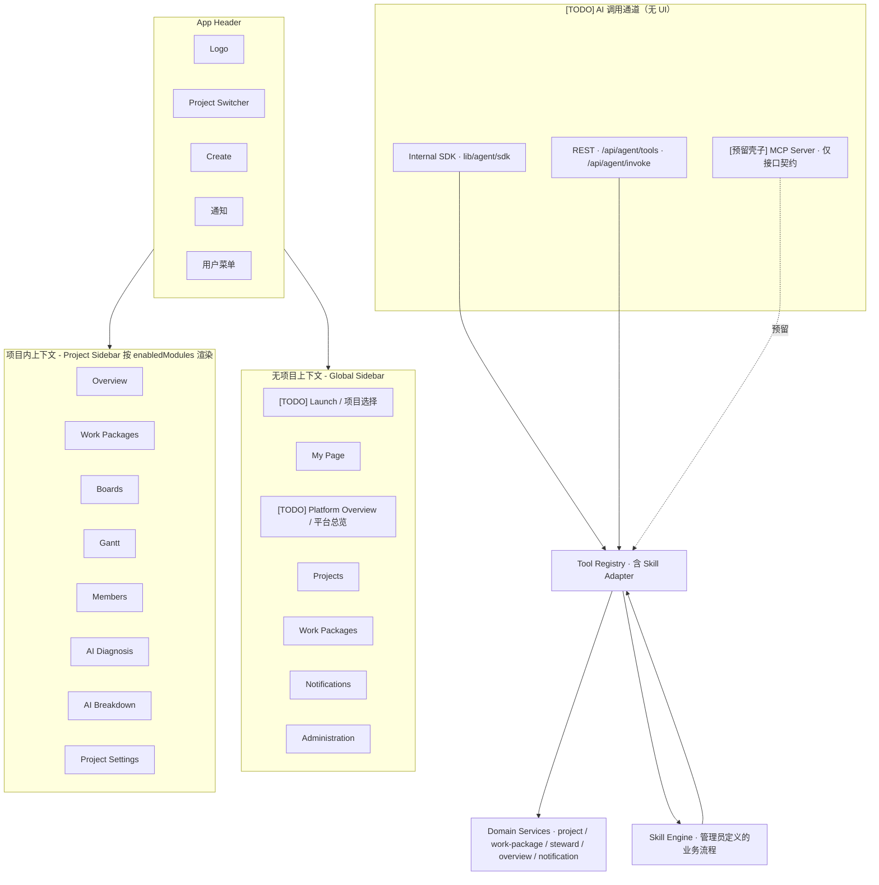
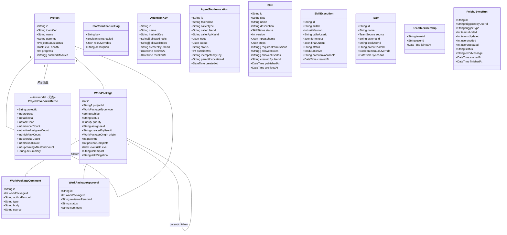

# Platform Architecture

## 0. 文档约定（必读 · AI Agent 也请遵循）

为避免「规划中能力」被当作「已落地能力」误用，本文档采用以下统一标记：

- `[TODO]`：规划中、**尚未**在代码中落地的特性。包含该标记的条目，AI Agent 在执行任务时应：
    - 不要在生成代码 / 写注释 / 写测试时把它当作「现状已有」。
    - 仅当用户**明确要求实施**该条目时，才按描述落地；落地完成后请同步移除对应 `[TODO]` 并更新本文档。
- `(TODO · 第 N 阶段)`：整章 / 整节都是规划阶段的特性。
- 验收清单（§9）中 `[x]` = 已验证；`[ ]` 与 `[TODO]` 等价，待落地。
- `[已落地]`：明确标注已实现的条目（默认无标注的旧条目按已落地理解）。
- 当且仅当**代码与本文档同步更新**，才能把 `[TODO]` 移除。

**本文档当前 TODO 集中索引**：见 §10.0「实施待办清单」。

## 1. 架构目标

平台参考开源项目管理系统 [OpenProject 16.x](https://www.openproject.org/) 的信息架构，把项目管理工作收敛为「项目层级 + 工作项 + 模块化导航」三件事，并把 AI 诊断 / 拆解 / 通知作为可配置模块嵌入项目侧边栏。

第一阶段确定的边界：

- 用户进入页面后看到 OpenProject 风格的「顶部 + 左侧栏 + 主内容区」三栏布局。
- 项目支持 parent / sub-project 层级，子项目按层级缩进显示。
- Task / Risk / Milestone / Phase 统一为 `WorkPackage`，按 `type` 分门别类。
- 每个项目可独立启用 / 禁用模块（OpenProject "enabled modules"），项目侧边栏据此动态渲染。
- AI 诊断 / 拆解 / 通知是平台特色，以独立模块出现在项目侧边栏，不再与主工作流堆叠在一页内。

第二阶段扩展边界（**全部 `[TODO]`，分别详见 §10、§11**）：

- `[已落地]` 「我的工作台」(`/my/page`) 升级为个人工作项管理入口，工作项不再强绑定项目，支持纯个人事项与项目工作项混排（详见 §10）。
- `[已落地]` 提供个人版 AI 拆解：用户在工作台输入需求 → AI 拆出候选工作项 → 用户挑选/编辑后写入「我的工作台」，默认归属个人，可后续挂载到项目（详见 §10）。
- `[已落地]` 工作项删除遵循「创建者 + 管理员」规则：PM 创建并分配给我的工作项，被分配者不可删除（详见 §10）。
- `[已落地]` 首屏改为「项目启动选择页 (`/launch`)」：进入应用先选择要操作的项目卡片，或显式跳过进入「我的工作台」（详见 §11）。
- `[已落地]` 新增「平台总览 (`/overview`)」：以仪表盘形式总览全部可见项目的进度、工作项数、人数、风险、逾期、阻塞、即将到期里程碑等核心指标，**取代**当前 `(global)/projects` 的扁平层级树作为「跨项目鸟瞰」入口；项目层级树保留为 `/projects` 二级视图（详见 §11）。
- `[已落地]` 「我的工作台」对个人项目 / 个人工作项 / 个人通知的可见性，受**站点级 + 角色级**的「平台模块开关」控制，由管理员在 `/admin` 配置（详见 §11.4）。
- `[已落地]` 「平台总览」具备「大屏看板模式 (`/overview/screen`)」：深色主题、横向甘特（按季度/月份分列、按阶段/任务分行）、关键路径红框、里程碑菱形、今日竖线、关键节点徽章、底部图例；适配 1920×1080 / 4K 投屏（详见 §11.6）。
- `[已落地]` 全平台业务能力封装为统一的 **AI 友好工具集（Agent Tools）**，单一 `Tool Registry` 在第二阶段通过「内部 SDK + REST API」两端暴露给所有登录用户的 AI 助手使用，按调用者权限严格收敛可调用工具集；MCP 端**仅保留接口契约**，本期不实现（详见 §12）。
- `[TODO]` 引入 **Skill 体系**：管理员在 `/admin/skills` 通过「表单映射」低代码地把若干 Tool 编排为业务流程（如"启动新项目"、"周报生成"、"风险升级"），所有 Skill 自动注册为 `skill.<slug>` 暴露给 AI；普通用户在自己的权限范围内调用 Skill，管理员是 Skill 与 AI 执行的最高权限角色（详见 §13）。
- `[TODO]` 角色体系扩展为 **多角色 + 团队层级**：`PlatformRole` 新增 `TEAM_LEAD`；`User.role` 改为 `User.roles[]`，支持一人多角色叠加。新增 `Team` / `TeamMembership` 模型；团队负责人可给团队成员分配工作项，并对成员"自报完成"的工作项进行**核对**（pass / reject），驳回会把工作项置回未完成并通知本人（详见 §14）。
- `[TODO]` 人员主数据由 **飞书组织架构导入**：定时 + 手动触发同步，飞书的部门负责人自动获得 `TEAM_LEAD` 角色；`PROJECT_MANAGER` 与 `PARTICIPANT` 由管理员在 `/admin/users` 动态颁发 / 回收；管理员持 `manageUserRoles` 是唯一能改角色的人（详见 §14）。
- `[TODO]` 引入统一产品北极星：平台不是传统项目管理系统叠加 AI，而是 **AI 项目统筹 + 个人办公落地 + 计划智能排程** 的一体化业务平台。普通员工只保留极简工作台与 AI 协助入口；团队负责人 / 项目经理按管理层级逐步增加能力；管理员拥有全量配置、角色、Skill、AI 执行与系统治理权限（详见 §15）。
- `[TODO]` 增加 **AI 难度评估与计划倒排引擎**：任务拆解后由 AI 自动评估难度 / 不确定性 / 所需技能 / 估时可信度；项目计划支持从目标里程碑倒排；大屏拖动关键节点或任务时间后，系统生成排程变更方案，自动重算依赖、关键路径、受影响任务与通知，不直接静默写库（详见 §15.4、§15.5）。

## 2. 信息架构



切换上下文的判定来自路由：进入 `/projects/[identifier]/...` 自动加载该项目并切换为项目侧边栏；其他路径走 `(global)` 路由组的全局侧边栏。

`[TODO]` 全局侧边栏顺序的目标态：**Launch → My Page → Platform Overview → Projects → Work Packages → Notifications → Administration**。其中 `Launch` 仅在「未做项目选择 / 用户主动点击」时高亮；`Platform Overview` 与 `Projects` 是同一信息（所有项目）的两种视图（仪表盘 vs 层级树）。

## 3. 路由结构（Next.js App Router）

```
app/
  layout.tsx                                # 根 html/body + 全局 CSS
  page.tsx                                  # [已落地] 重定向：首次 /launch；已选择项目进项目；跳过进 /my/page
  (global)/
    layout.tsx                              # AppShell + GlobalSidebar
    launch/page.tsx                         # [已落地] 项目启动选择页（项目卡片网格 + 「进入我的工作台」入口）
    my/page/page.tsx                        # 我的工作台（快速新建 + 并集列表 + 来源/删除/挂项目已落地；个人通知/FeatureFlag 见 PWP-21）
    my/work-packages/new/page.tsx           # [已落地] 个人新建工作项（可选项目，可留空）
    my/breakdown/page.tsx                   # [已落地] 个人 AI 拆解（无项目上下文）
    overview/page.tsx                       # [已落地] 平台总览（仪表盘：每项目 KPI + 风险/逾期/阻塞排行）
    overview/screen/page.tsx                # [已落地] 大屏看板模式（深色全屏甘特 + 关键路径 + 今日线 + 自动刷新）
    projects/page.tsx                       # 所有项目（层级树）；总览不再走这里
    projects/new/page.tsx                   # 创建项目
    work-packages/page.tsx                  # 跨项目工作项
    notifications/page.tsx                  # [已落地] 通知中心站内收件箱
    admin/page.tsx                          # 管理员区
    admin/feature-flags/page.tsx            # [已落地] 平台模块开关（站点级 + 角色级覆盖）
    admin/notifications/page.tsx            # [已落地] 通讯通道 + 路由规则配置
    admin/users/page.tsx                    # [TODO] 用户列表 + 角色集分配 + 团队归属（来自飞书显示只读，可手动覆盖）
    admin/teams/page.tsx                    # [TODO] 团队层级树 + 创建 / 编辑 / 同步状态
    admin/teams/[id]/page.tsx               # [TODO] 团队详情 + 成员管理
    admin/integrations/feishu/page.tsx      # [TODO] 飞书集成配置 + 触发同步 + 上次同步摘要
  projects/
    [identifier]/
      layout.tsx                            # 加载项目 + ProjectSidebar
      page.tsx                              # 重定向到 overview
      overview/page.tsx                     # 项目概览（统计 / 健康度 / 风险）
      work-packages/page.tsx                # 表格 + split-screen 详情
      work-packages/[id]/page.tsx           # 工作项详情全屏
      boards/page.tsx                       # 看板（按 status）
      gantt/page.tsx                        # 时间线
      members/page.tsx                      # 成员
      ai-diagnosis/page.tsx                 # AI 诊断（特色模块）
      ai-breakdown/page.tsx                 # AI 拆解（特色模块）
      settings/page.tsx                     # 项目设置（含模块开关）
  api/
    workspace/route.ts                      # 工作区引导（projects + counts）
    projects/route.ts                       # GET / POST 项目
    projects/[identifier]/route.ts          # GET / PATCH 单项目
    work-packages/route.ts                  # GET / POST 工作项（projectId 可空 = 个人事项）[已落地]
    work-packages/[id]/route.ts             # PATCH / DELETE 工作项；DELETE 按 §10.3 规则 [已落地]
    work-packages/[id]/comments/route.ts    # POST 评论 / 证据
    work-packages/[id]/approvals/route.ts   # POST 签核
    assistant/route.ts                      # AI 拆解草稿（projectId 可空 = 个人草稿）[已落地]
    agent-workflow/confirm/route.ts         # 草稿确认 → WorkPackage（个人草稿 → AI_SELF 个人工作项）[已落地]
    im-comment/route.ts                     # 外部 IM 评论回流
    notifications/route.ts                  # [已落地] GET 当前用户收件箱 / POST 向指定用户发送站内通知 / PATCH 标记已读
    feishu/robot/route.ts                   # [已落地] GET 机器人状态 / POST 按业务传入 title、body 发送飞书卡片
    steward/route.ts                        # AI 管家进展摘要
    overview/route.ts                       # [已落地] GET 平台总览数据（每项目 KPI 聚合）
    overview/screen/route.ts                # [已落地] GET 大屏看板数据（阶段+任务+里程碑+关键路径）
    feature-flags/route.ts                  # [已落地] GET / PATCH 平台模块开关（仅 admin）
    agent/tools/route.ts                    # [已落地] GET 工具清单（OpenAI/Anthropic 风格 schema 数组）
    agent/invoke/route.ts                   # [已落地] POST 工具执行（statelessly 一次一个）
    agent/api-keys/route.ts                 # [已落地] GET / POST / DELETE Agent API Key（仅 admin）
    agent/audit/route.ts                    # [已落地] GET Agent 调用审计（按用户 / 工具 / 时间段过滤）
    mcp/[transport]/route.ts                # [已落地预留壳子] MCP Streamable HTTP；本期仅返回 501 + 接口契约
    skills/route.ts                         # [TODO] GET 当前用户可见 Skill 列表 / POST 创建（仅 admin）
    skills/[id]/route.ts                    # [TODO] GET / PATCH / DELETE 单个 Skill（管理仅 admin）
    skills/[id]/execute/route.ts            # [TODO] POST 表单数据执行 Skill（按调用者权限校验）
    skills/[id]/executions/route.ts         # [TODO] GET 该 Skill 的历史执行记录（仅自己 + admin）
    teams/route.ts                          # [TODO] GET 团队列表 / POST 创建（仅 admin）
    teams/[id]/route.ts                     # [TODO] GET / PATCH / DELETE 单团队（仅 admin）
    teams/[id]/members/route.ts             # [TODO] GET / POST / DELETE 团队成员（admin / 该团队 lead）
    users/route.ts                          # [TODO] GET 用户列表（admin 全量、其他过滤）
    users/[id]/roles/route.ts               # [TODO] PATCH 调整用户角色集（仅 admin · manageUserRoles）
    work-packages/[id]/verify/route.ts      # [TODO] POST 团队负责人核对（pass / reject + reason）
    work-packages/[id]/self-report/route.ts # [TODO] POST 团队成员自报完成（status=done + verificationStatus=SELF_REPORTED_DONE）
    integrations/feishu/sync/route.ts       # [TODO] POST 触发飞书组织架构同步（仅 admin · importOrgFromFeishu）
    integrations/feishu/status/route.ts     # [TODO] GET 同步状态、上次时间、变更摘要
    health/route.ts                         # 健康检查
```

`[已落地预留壳子]` 此外，规划独立 stdio 入口，本期仅放占位文件 + 契约文档，不接 Tool Registry：

```
scripts/
  mcp-server.ts                            # [已落地预留壳子] 占位入口；执行时打印「MCP 暂未实现，参见 docs/agent/mcp-spec.md」
docs/agent/
  mcp-spec.md                              # [TODO 预留契约] MCP 工具映射规范，定义未来真实实现的 ListTools / CallTool / Resources 形态
```

## 4. 数据模型

核心对象：



亮点：

- **Project 层级**：`parentId` 自引用，UI 在多个地方按层级缩进显示。
- **WorkPackage 统一模型**：之前的 `Task` / `Risk` 合并为一种实体，依靠 `type` 字段区分。Risk 类型额外携带 `riskLevel / riskImpact / riskMitigation`。
- `[已落地]` **WorkPackage 可个人化**：`projectId` 已改为可空。`null` 表示纯个人事项，服务端快照仅向本人和管理员暴露；非空仍是项目工作项。
- `[已落地]` **WorkPackage 来源标识**：已新增 `origin` 枚举（`SELF` / `AI_SELF` / `MANAGER` / `IM_IMPORT`），用于 UI 标签、审计与权限判断。
- `[已落地]` **WorkPackage 创建者**：已新增 `createdByUserId`，与 `assigneeId` 解耦。删除权限以「创建者本人 + 管理员」为准（详见 §10.3）。
- **enabledModules**：每个项目以 JSON 数组保存 OpenProject 风格的模块开关，UI 据此渲染侧边栏。
- **WorkPackage 整数 ID**：与 OpenProject 一致，全局自增，便于 `#123` 引用。
- `[已落地]` **PlatformFeatureFlag**：站点级别的「平台模块开关」表，每条对应一个可被管理员关闭的模块（如 `personalWorkPackage` / `personalAgentBreakdown` / `personalNotifications` / `platformOverview`）。`siteEnabled` 是总开关，`roleOverrides` 用 JSON 字符串存按角色的细粒度覆盖，例：`{"participant": false}` 表示参与员看不到该模块。
- `[已落地]` **ProjectOverviewMetric**：纯派生视图模型（不落表），由 `lib/services/platform-overview.ts` 在请求时按当前用户可见项目集聚合计算，给 `/overview` 与 `/launch` 的项目卡片消费。
- `[已落地]` **AgentApiKey**：用于非交互式 AI 客户端（CI / 自动化 / 未来外部 MCP 客户端）。`hashedKey` 仅存哈希；`allowedTools` 限定可调用工具集；`allowedRoles` 限定借用的角色身份；管理员可在 `/admin/agent-keys` 颁发与撤销。
- `[已落地]` **AgentToolInvocation**：所有 AI 工具调用审计日志（who / how / when / tool / input / output / 状态 / 耗时 / idempotency key / parentInvocationId）。经过 `Tool Registry` 的调用会落审计；`parentInvocationId` 用于后续 Skill 执行下追踪子调用链。
- `[TODO]` **Skill**：管理员定义的业务流程模板，由 `inputSchema`（表单字段）+ `steps`（编排：tool / branch / transform / ai-prompt）组成。`status` ∈ `draft | published | archived`；`requiredPermissions / allowedRoles / allowedUserIds` 三层叠加控制谁能调用。每个发布的 Skill 由 Skill Adapter 自动注册为 Tool `skill.<slug>` 暴露给 AI。详见 §13。
- `[TODO]` **SkillExecution**：Skill 执行记录。`formInput` 为用户/AI 提交的表单数据；`finalOutput` 为最后一步输出；通过 `parentInvocationId` 与若干 `AgentToolInvocation` 关联，构成完整执行链路，可在 `/admin/agent-audit` 与 `/skills/[id]/executions` 串联展示。
- `[TODO]` **角色多选**：`User.role: PlatformRole`（旧）→ `User.roles: PlatformRole[]`（新），用 JSON 数组持久化；判断权限时 `userPermissions = ⋃(rolePermissions[r] for r in user.roles)`。`PlatformRole` 枚举新增 `TEAM_LEAD`。
- `[TODO]` **Team / TeamMembership**：团队层级与成员关系。`source ∈ {FEISHU, MANUAL}`；`externalId` 存飞书部门 ID；`parentTeamId` 形成层级；`manualOverride=true` 的团队不会被下次飞书同步覆盖。`leadUserId` 自动派生：飞书来源时 = 飞书部门负责人；MANUAL 时由 admin 指定。
- `[TODO]` **WorkPackage 核对增量**：新增 `verificationStatus`（`NOT_REQUIRED | PENDING | SELF_REPORTED_DONE | VERIFIED | REJECTED`，默认 `NOT_REQUIRED`）、`verifiedByUserId`、`verifiedAt`、`rejectedReason`、`requiresVerification` (Bool)；当 `assignee` 与 `createdBy` 不同且 `createdBy` 是该 assignee 的某团队 lead 时自动 `requiresVerification=true` + `verificationStatus=PENDING`。
- `[TODO]` **FeishuSyncRun**：每次飞书同步的运行记录，便于审计与排错；管理员可在 `/admin/integrations/feishu` 查看历史与失败原因。

## 5. 模块边界

| 模块 | 主路径 | 数据依赖 | 说明 |
| --- | --- | --- | --- |
| AppShell | `components/layout/AppShell.tsx` | `Project[]`, `User?` | 顶栏 + 侧边栏槽位 |
| GlobalSidebar | `components/layout/GlobalSidebar.tsx` | 路径 | 无项目上下文导航 |
| ProjectSidebar | `components/layout/ProjectSidebar.tsx` | `Project.enabledModules` | 项目内导航 |
| ProjectSwitcher | `components/layout/ProjectSwitcher.tsx` | `Project[]` | 顶栏带层级的项目切换器 |
| ProjectTree | `components/projects/ProjectTree.tsx` | `Project[]` | 项目列表树 |
| WorkPackageTable | `components/work-packages/WorkPackageTable.tsx` | `WorkPackage[]`, `Person[]` | OpenProject 风格表格 |
| WorkPackageDetailPane | `components/work-packages/WorkPackageDetailPane.tsx` | `WorkPackage`, `Comment[]`, `Approval[]` | split-screen 详情 |
| KanbanBoard | `components/boards/KanbanBoard.tsx` | `WorkPackage[]` | 按 status 看板 |
| GanttChart | `components/gantt/GanttChart.tsx` | `WorkPackage[]` | SVG 时间线 |
| `[已落地]` MyWorkbench | `app/(global)/my/page/page.tsx` | `WorkPackage[]`, `User`, `Project[]` | 我的工作台基础闭环：分配项 + 自创建项统一表 + 快速新建入口 + 来源 / 删除 / 挂项目；个人通知与 FeatureFlag 隐藏见 PWP-21 |
| `[已落地]` PersonalWorkPackageForm | `components/work-packages/PersonalWorkPackageForm.tsx` | `Project[]?` | 个人新建工作项表单（项目可选） |
| `[已落地]` PersonalAIBreakdown | `components/ai/PersonalAIBreakdown.tsx` | `User` | 无项目上下文的 AI 拆解；草稿默认写入个人事项 |
| `[已落地]` LaunchPage | `app/(global)/launch/page.tsx` | `Project[]`, `User` | 项目启动选择页：项目卡片网格 + 「进入我的工作台」入口；记忆上次选择 |
| `[已落地]` PlatformOverview | `app/(global)/overview/page.tsx` | `ProjectOverviewMetric[]` | 平台总览：顶部全局 KPI + 项目卡片网格 + 风险/逾期排行 |
| `[已落地]` ProjectKpiCard | `components/overview/ProjectKpiCard.tsx` | `ProjectOverviewMetric` | 单项目 KPI 卡片，复用于 `/overview`；`/launch` 使用同源指标 |
| `[已落地]` GlobalKpiBar | `components/overview/GlobalKpiBar.tsx` | `GlobalOverviewKpi` | 总览顶部全局 KPI 条 |
| `[已落地]` AdminFeatureFlagsForm | `components/admin/FeatureFlagsTable.tsx` | `PlatformFeatureFlag[]` | 管理员可见性开关：站点级 + 角色级覆盖 |
| `[已落地]` BigScreenLayout | `components/big-screen/BigScreenLayout.tsx` | `BigScreenViewModel` | 大屏看板根布局（深色 + Banner + 主体甘特 + 图例） |
| `[已落地]` ScreenHeaderBanner | `components/big-screen/BigScreenLayout.tsx` | `ProjectMeta`, `MilestoneSummary[]` | 顶部信息条（项目名 + 周期 + 关键里程碑日期徽章 + 状态/年份） |
| `[已落地]` TimelineGrid | `components/big-screen/BigScreenLayout.tsx` | `TimelineConfig` | 季度+月份双层表头与垂直网格线 |
| `[已落地]` PhaseRow / TaskBar / MilestoneDiamond | `components/big-screen/BigScreenLayout.tsx` | `Phase` / `Task` / `Milestone` | 阶段行（带左侧色条 + 进度条 + 关键问题文字）/ 任务条 / 里程碑菱形 |
| `[已落地]` CriticalPathOverlay | `components/big-screen/BigScreenLayout.tsx` | `WorkPackage[]` | 关键路径红色描边层（叠加在 TaskBar 之上） |
| `[已落地]` TodayLine | `components/big-screen/BigScreenLayout.tsx` | `Date` | 今日红色竖线 + 顶部「今日」徽章 |
| `[已落地]` LegendBar | `components/big-screen/BigScreenLayout.tsx` | — | 底部图例（已完成/进行中/待开始/里程碑/关键节点/今日/关键路径/各阶段色块） |
| `[已落地]` ScreenAutoRefresh | `components/big-screen/ScreenAutoRefresh.tsx` | — | 客户端组件，定时刷新；带连接状态指示 |
| `[已落地]` ToolRegistry | `lib/agent/tools/registry.ts` | — | 单一工具描述表：name / description / Zod inputSchema / outputSchema / requiredPermissions / handler / writeLevel |
| `[已落地]` ToolHandlers | `lib/agent/tools/registry.ts` | 各 Domain Service | 工具 handler 通过现有 `lib/services/*` 调用，复用 RBAC 与业务逻辑 |
| `[已落地]` AgentInvokePipeline | `lib/agent/invoke.ts` | `ToolRegistry`, `auth`, `audit` | 统一执行管道：鉴权 → RBAC + FeatureFlag 校验 → schema 校验 → idempotency 检查 → 调用 → 审计 → 返回；危险写操作两步确认（preview / confirm） |
| `[已落地预留壳]` McpServer | `scripts/mcp-server.ts`、`app/api/mcp/[transport]/route.ts` | 契约文档 | 本期仅保留 stdio + Streamable HTTP 占位壳，返回 501 与 `docs/agent/mcp-spec.md` |
| `[已落地]` AdminAgentKeysForm | `components/admin/AgentKeysPanel.tsx` | `AgentApiKey[]` | 颁发 / 撤销 / 限定 API Key 的可见 UI |
| `[已落地]` AdminAgentAuditView | `components/admin/AgentAuditView.tsx` | `AgentToolInvocation[]` | 审计日志查询：按调用者 / 工具 / 时间段 / 状态过滤 |
| `[TODO]` SkillEditor | `components/skills/SkillEditor.tsx` | `Skill?`, `Tool[]` | 管理员创建 / 编辑 Skill 的低代码编辑器：表单字段编辑器 + 步骤编排器（拖拽顺序 + 参数映射 + 条件分支） |
| `[TODO]` SkillFormBuilder | `components/skills/SkillFormBuilder.tsx` | — | 子组件：图形化定义 `inputSchema` 字段（type / label / required / validation / placeholder） |
| `[TODO]` SkillStepBuilder | `components/skills/SkillStepBuilder.tsx` | `Tool[]` | 子组件：每一步选择 Tool → 用 JSONata / 简单表达式映射参数 → 配置输出绑定 |
| `[TODO]` SkillCatalog | `components/skills/SkillCatalog.tsx` | `Skill[]` | 用户视角的 Skill 列表：按分类/搜索词浏览，仅显示自己有权限的 |
| `[TODO]` SkillRunner | `components/skills/SkillRunner.tsx` | `Skill` | 用户执行 Skill 的运行器：自动渲染表单 → 提交 → 流式展示步骤进度 + 最终输出 |
| `[TODO]` AdminUsersTable | `components/admin/UsersTable.tsx` | `User[]`, `Team[]` | 用户列表 + 角色多选编辑 + 飞书来源标签 + 手动覆盖标记 |
| `[TODO]` AdminTeamsTree | `components/admin/TeamsTree.tsx` | `Team[]` | 团队层级树视图，按 parent/children 缩进；点击进入团队详情 |
| `[TODO]` AdminTeamDetail | `components/admin/TeamDetail.tsx` | `Team`, `TeamMembership[]` | 团队基本信息 + 负责人 + 成员管理（增删 + 飞书源不可编辑提示） |
| `[TODO]` FeishuIntegrationPanel | `components/admin/FeishuIntegrationPanel.tsx` | `FeishuSyncRun[]` | 飞书集成配置 + 「立即同步」按钮 + 历史同步记录折叠 |
| `[TODO]` VerificationPanel | `components/work-packages/VerificationPanel.tsx` | `WorkPackage`, `User` | 工作项详情中的"核对"区块：团队负责人可见，含 pass / reject 按钮 + 驳回原因输入 |
| `[TODO]` SelfReportButton | `components/work-packages/SelfReportButton.tsx` | `WorkPackage`, `User` | 团队成员"提交完成"按钮；提交后状态变为 SELF_REPORTED_DONE，等待核对 |
| `[TODO]` MyTeamWorkInbox | `components/team-lead/MyTeamWorkInbox.tsx` | `WorkPackage[]` | 团队负责人的「我团队的工作项」区块（在 My Page 内显示），按"待核对 / 进行中 / 已完成"分组 |
| AIDiagnosisPanel | `components/ai/AIDiagnosisPanel.tsx` | `ProjectDiagnosis` | AI 诊断模块 |
| AIBreakdownWorkspace | `components/ai/AIBreakdownWorkspace.tsx` | `Project`, `User?` | 项目 AI 拆解模块 |
| `[已落地]` NotificationCenterView | `components/notifications/NotificationCenterView.tsx` | `UserNotification[]`, `User?` | 通知中心站内收件箱（已读/未读 + 一键已读） |
| `[已落地]` NotificationSettingsView | `components/admin/NotificationSettingsView.tsx` | `NotificationChannel[]`, `NotificationRule[]` | 管理员查看通讯通道与路由规则 |
| Primer 原子 | `components/primer/*` | — | Button / Input / Select / Textarea / Badge / Surface / Drawer / EmptyState |

## 6. 关键服务

- `lib/services/workspace.ts`：单一入口加载工作区快照（含项目层级 / WorkPackage / 通知配置 / Steward 消息），失败回退到 `lib/sample-data.ts`。
- `lib/services/auth-context.ts`：路由处理器内的角色解析；当前优先按 session / `x-open-id` 识别用户，并兼容历史 `x-user-id`。
- `lib/services/auth-server.ts`：服务端组件读取当前用户（基于 cookie；飞书登录成功后当前写入的是 `open_id`，再映射回内部用户）。
- `lib/services/project-workflow.ts`：项目创建 / 更新 / 模块开关。
- `lib/services/work-package-workflow.ts`：工作项创建 / 更新 / 评论 / 签核 / 删除。`[已落地]` `projectId` 接受 `null`（个人事项），`createdByUserId` 必填，删除按「创建者本人 + 管理员」校验。
- `lib/services/agent-breakdown.ts`：AI 草稿生成与确认（确认后写入 `WorkPackage` 表）。`[已落地]` `projectId` 可空，个人草稿确认后写为 `projectId=null` + `origin=AI_SELF` 的个人工作项。
- `lib/intelligence/*`：Health / Reminders / Scheduling / Diagnosis 四件套，全部基于新 `WorkPackage` 模型。
- `lib/notifications/*`：Channel 适配 + 路由规则匹配 + 投递构建。
- `[已落地]` `lib/services/user-notifications.ts`：站内通知收件箱服务；提供按用户查询消息、向指定用户批量发送通知，以及按用户将消息标记为已读。发送侧支持 `recipientOpenIds`，会先映射飞书绑定再落内部 `user.id`；查询侧通过 `UserNotification.recipient` 关系回表补充 `recipientOpenId`。此外，服务端会汇总当前用户未读数供顶部/侧栏展示；超一天未读飞书提醒仅由独立定时入口扫描触发，并记录提醒时间避免重复发送。
- `[已落地]` 审核消息与普通通知在通知中心内已分流：待处理的 `notification-review-request` 不再进入收件箱，而是只通过待审核视图展示当前用户仍需处理的 `NotificationReviewRequest`；收件箱仅保留普通通知与审核结果消息。批量“一键已读”会主动排除审核请求消息，只有在审核完成时才会自动把原审核消息回写为已读。
- `[已落地]` 顶部与侧栏红点的未读汇总已切到业务语义口径：按“普通未读 `UserNotification`（排除审核请求镜像消息） + 待审核 `NotificationReviewRequest`”聚合，确保待审核也计入红点且不重复统计。
- `[已落地]` `components/layout/UnreadNotificationAutoRefresh.tsx`：通知未读红点自动刷新器；登录态下会周期性执行 `router.refresh()`，并在窗口重新聚焦或标签页重新可见时立即刷新，避免头部/侧栏未读红点停留在首屏快照。
- `[已落地]` `app/api/notifications/reminders/overdue/route.ts` + `scripts/send-overdue-notification-reminders.mjs`：受 `NOTIFICATION_REMINDER_CRON_TOKEN` 保护的定时入口；可由系统计划任务或外部调度器按计划扫描全量用户的超时未读消息，并发送飞书卡片提醒。
- `[已落地]` `NotificationReviewRequest` + `app/api/notifications/reviews/**`：审核消息闭环接口；业务可向审核人 A 发起审核请求，A 提交审核结果后，系统自动把结果以站内通知回发给被审核用户。
- `[已落地]` `FeishuDepartmentTreeSnapshot.departmentOptionsJson / excludedDepartmentIdsJson` + `PATCH /api/feishu/departments`：部门树同步设置；管理员可在“同步部门树”按钮下方配置下次同步要屏蔽的部门，服务端在真正同步时按 `open_department_id` 跳过这些部门及其子部门。
- `[已落地]` `lib/services/platform-overview.ts`：聚合服务。输入「当前用户可见项目集」，输出 `ProjectOverviewMetric[]` + 顶部全局 KPI（总项目 / 总工作项 / 高风险项目 / 逾期数 / 阻塞数 / 即将到期里程碑数）。复用 `lib/steward.ts` 与工作区快照，不引入新数据源。
- `[已落地]` `lib/services/feature-flags.ts`：读写 `PlatformFeatureFlag`，提供 `isModuleEnabledForUser(moduleKey, user)` 工具，被 `MyWorkbench` / 全局侧边栏 / 各 `/my/*` 路由 SSR 调用以决定渲染与否。
- `[已落地]` `lib/services/launch-preferences.ts`：以 cookie 形式记忆「上次选择的项目」与「是否跳过启动页」，给 `/` 重定向逻辑使用。
- `[已落地]` `lib/services/big-screen.ts`：大屏数据装配。输入「项目 ID」，输出 `BigScreenViewModel`：项目元数据 + 阶段树（`WorkPackageType=PHASE` 父节点 + 子任务）+ 里程碑列表 + 关键路径标识集合 + 今日时间戳 + 阶段统计。
- `[已落地]` `lib/intelligence/critical-path.ts`：从 `WorkPackage.dependencies`（已有字段）+ `dueDate` 推导关键路径，输出 `Set<workPackageId>`；缺少依赖数据时回退为 P0 高优先级启发式。
- `[已落地]` `lib/agent/tools/registry.ts`：工具注册表。声明每个工具的 name / description / Zod inputSchema / outputSchema / requiredPermissions / writeLevel（read | write | dangerous）/ handler 引用。
- `[已落地]` `lib/agent/sdk.ts`：内部 SDK，封装 `invoke(toolName, input, ctx)` 给现有 assistant/confirm 路由与未来对话式管家直接调用，无需经过 HTTP。
- `[已落地]` `lib/agent/invoke.ts`：统一执行管道（鉴权 → RBAC + FeatureFlag → schema 校验 → idempotency → handler → 审计 → 序列化）。SDK / REST 共用同一管道，MCP 本期保留壳子。
- `[已落地预留壳]` `scripts/mcp-server.ts` + `app/api/mcp/[transport]/route.ts`：本期仅返回未实现提示和契约文档链接，不接 Tool Registry。
- `[已落地]` `lib/agent/audit.ts`：审计日志写入；提供 `recordInvocation()`，支持按 `parentInvocationId` 串联后续 Skill 子调用。
- `[已落地]` `lib/agent/auth.ts`：双轨鉴权——用户登录态（cookie + `x-open-id`，兼容历史 `x-user-id`，AI 代用户操作）与 `AgentApiKey`（机器调用）；解析后注入统一的 `AgentCallContext`。
- `[TODO]` `lib/agent/skills/registry.ts`：Skill 加载器，启动时从数据库读取所有 `published` Skill 并注册为 Tool `skill.<slug>`，由 `Tool Registry` 统一暴露；Skill 的 `inputSchema` 直接映射为 Tool 的 `inputSchema`。
- `[TODO]` `lib/agent/skills/engine.ts`：Skill 执行引擎。按 `steps` 顺序执行：每一步通过 JSONata 表达式（`lib/agent/skills/expr.ts`）从 `formInput` + 累计的 `stepOutputs` 计算出入参，调用对应 Tool；支持 `branch`（条件分支）、`transform`（纯映射，不调用 Tool）、`ai-prompt`（占位，后期接 LLM）三种节点类型；写入 `SkillExecution` + 一组带 `parentInvocationId` 的 `AgentToolInvocation`。
- `[TODO]` `lib/agent/skills/permissions.ts`：Skill 权限解析。`canExecuteSkill(user, skill)` 判定 = `requiredPermissions ⊂ user.permissions` ∧ (`allowedRoles` 含当前角色 ∨ `allowedUserIds` 含当前用户)；`canManageSkills(user)` 判定 = 仅 admin。
- `[TODO]` `lib/agent/skills/expr.ts`：参数映射表达式求值器。第一版用 [JSONata](https://jsonata.org/)（轻量 MIT，~50KB），仅在服务端运行；表达式执行有超时与白名单。
- `[TODO]` `lib/services/team-workflow.ts`：团队 CRUD、成员增删、负责人变更；区分 `source=FEISHU`（受同步覆盖）与 `MANUAL`（admin 手工管理 + `manualOverride=true` 防覆盖）。
- `[TODO]` `lib/services/user-roles.ts`：角色集编辑（增 / 删 / 替换）。仅 `manageUserRoles` 权限可调用；写入时校验"至少一个角色"，禁止把唯一管理员降级为非 admin（防自锁）。
- `[TODO]` `lib/services/verification-workflow.ts`：核对流程闭环。`selfReport(wpId, user)` → `verify(wpId, lead, decision, reason?)`；驳回时 `status` 回到 `in_progress`、`verificationStatus=REJECTED`、写 `WorkPackageComment(type=DECISION)` 留痕、触发 `notifications.send` 给 assignee。
- `[TODO]` `lib/integrations/feishu/client.ts`：飞书 OpenAPI 客户端（tenant_access_token 缓存、`contact/v3/users` 与 `contact/v3/departments` 拉取）；密钥从环境变量 `FEISHU_APP_ID` / `FEISHU_APP_SECRET` 读取。
- `[TODO]` `lib/integrations/feishu/sync.ts`：组织架构同步逻辑——按部门树拉取并 upsert `Team`、按部门 leader 字段计算 `leadUserId`、给 leader 用户 `roles` 自动加 `TEAM_LEAD`、按部门成员关系 upsert `TeamMembership`；尊重 `manualOverride` 与 `roles` 中已有的非飞书角色（不删除 admin / projectManager）。运行结果写入 `FeishuSyncRun`。
- `[TODO]` `lib/integrations/feishu/scheduler.ts`：定时调度（默认 6 小时一次），可在 `/admin/integrations/feishu` 配置；与手动触发共享同一份 `sync.ts`。

## 7. 视觉风格

UI 完全切换到 OpenProject 16.x 的 [Primer Design System](https://primer.style/) 浅色主题：

- 主背景 `#ffffff`，次背景 `#f6f8fa`，强调 `#eaeef2`。
- 边框 `#d0d7de` 主、`#d8dee4` 次。
- 主文 `#1f2328`，次文 `#656d76`。
- 主色 `#0969da`（accent），危险 `#cf222e`，成功 `#1a7f37`，注意 `#9a6700`，已完成 `#8250df`。
- 字号体系 13/14/20/24，行高 1.5；表格紧凑 (padding 8px 12px)。
- 按钮 `.btn`、表单 `.input/.select/.textarea`、表格 `.data-table`、徽章 `.badge` 在 `app/globals.css` 提供。

## 8. 模块开关与权限

- 路由 `/projects/[identifier]/<module>` 只在 `Project.enabledModules` 包含该模块时渲染，未启用时返回友好提示。
- RBAC 权限新增 `manageProjectModules`、`approveWorkPackages`、`useAgentBreakdown` 三项（参见 `lib/rbac.ts`）。
- `[已落地]` 第二阶段新增个人维度权限：`createPersonalWorkPackage`（任何角色都开）、`deleteOwnWorkPackage`（任何角色都开，作用域为本人创建的工作项）、`usePersonalAgentBreakdown`（任何角色都开）、`deleteAnyWorkPackage`（仅管理员）。
- 创建 / 修改项目走 `manageProjects`；调整模块开关走 `manageProjectModules`；签核走 `approveWorkPackages`。
- `[已落地]` 删除工作项规则：`createdByUserId === currentUser.id` 时按 `deleteOwnWorkPackage` 放行；管理员持 `deleteAnyWorkPackage` 越权放行；其余角色（含被分配的 PM）不得删除他人创建的工作项。
- 参与员视图自动过滤为本人负责的工作项；管理员看见全部。
- `[已落地]` 平台总览权限 `viewPlatformOverview`：默认 admin / projectManager / participant 全开；可见项目集仍按成员关系过滤——admin 看全部、PM 看自己 managed 的项目、participant 看自己 participating 的项目。
- `[已落地]` 平台模块开关权限 `managePlatformFeatureFlags`：仅 admin。每个模块同时受「站点级 `siteEnabled`」与「角色级 `roleOverrides[currentRole]`」双重判定，二者均为真才显示该模块入口（侧边栏 + 页面 SSR 入口都 enforce）。
- `[已落地]` 大屏看板权限 `viewBigScreen`：默认 admin / projectManager / participant 全开，但项目集仍按成员关系过滤；预设 FeatureFlag `bigScreen` 控制路由是否启用。匿名 / 未登录访问 `/overview/screen` 走只读路径（用于挂大屏机），由 `BIG_SCREEN_ANONYMOUS_TOKEN` 或默认演示 token 授权。
- `[已落地]` AI 工具调用权限：每个工具在 `ToolRegistry` 中声明 `requiredPermissions` 数组，统一执行管道根据 `AgentCallContext` 的角色判定。新增 RBAC：`useAgentTool`（默认 admin / projectManager / participant 全开，由具体工具的 `requiredPermissions` 收紧）、`manageAgentApiKeys`（仅 admin）、`viewAgentAudit`（admin / projectManager 全开，仅看自己授权范围内的调用）。
- `[已落地]` 写操作两步确认（默认对 `writeLevel='dangerous'` 工具强制启用）：第一次调用返回 dry-run 预览，必须带 `confirm=true` 二次调用才真执行；普通 `writeLevel='write'` 工具可由调用方传 `dryRun=true` 主动获取预演结果。
- `[TODO]` Skill 权限：新增 `manageSkills`（创建 / 编辑 / 发布 / 归档 Skill；**仅 admin**）、`useSkill`（默认全员开，但每个 Skill 还有自身的 `requiredPermissions / allowedRoles / allowedUserIds` 三层叠加）、`agentSuperuser`（**仅 admin**；持有此权限可在 Skill 编辑器选择"以系统身份执行"模式以及在 `/admin/agent-audit` 跨用户查看与回放）。
- `[TODO]` AI 通道总开关：用户登录态下，AI 通道（REST `/api/agent/*`）对所有登录用户开放；最终能调用的工具集 = `Tool.requiredPermissions ⊂ user.permissions ∩ FeatureFlag.agentTools.enabled`。管理员是天然的「所有权限并集」+ `agentSuperuser`，因此**对所有 Tool / Skill 拥有最高执行权**。
- `[TODO]` 多角色权限规则：`User.roles: PlatformRole[]`；`userPermissions = ⋃(rolePermissions[r] for r in user.roles)`。所有 `can(role, perm)` 调用须改为 `canUser(user, perm)`，遍历角色集求并集。
- `[TODO]` 团队负责人新增 RBAC：`assignTeamWorkPackages`（给本人为 lead 的团队成员分配工作项）、`verifyTeamWorkPackages`（核对自己分配出去的工作项）、`viewTeamInbox`（查看「我团队的工作项」）。这三条**仅作用域到 `currentUser` 是 `lead` 的团队**；admin 持 `manageTeams` 越权。
- `[TODO]` 团队管理与角色管理新增 RBAC：`manageTeams`（创建/编辑/删除团队及成员、仅 admin）、`manageUserRoles`（编辑用户 `roles[]`、仅 admin）、`importOrgFromFeishu`（触发飞书同步、仅 admin）。
- `[TODO]` 工作项删除规则增量（与 §10.3 合并）：团队负责人对**自己创建并分配出去的工作项**有删除权；团队成员被分配的工作项**不能删**（与 PM 分配场景一致）；`createdByUserId` 已经覆盖此规则，无需新字段。
- `[TODO]` 工作项核对权限：`verify(wpId, decision)` 必须满足：`wp.createdByUserId === currentUser.id` ∧ `currentUser` 拥有 `verifyTeamWorkPackages` ∧ `wp.assigneeId` 在 `currentUser` 为 lead 的团队成员集合中；admin 越权放行。

## 9. 验收清单

- [x] 进入 `/` 重定向到 `/my/page`，主区域是 OpenProject 风格的我的工作台。
- [x] 顶部项目切换器列出所有项目，按 parent / sub-project 缩进。
- [x] `/projects` 显示项目层级树，可创建项目。
- [x] 项目内侧边栏严格按 `enabledModules` 渲染。
- [x] `/projects/[id]/work-packages` 是「表格 + 右侧详情抽屉」的 split-screen 布局。
- [x] 工作项详情可更新进展、写评论、签核（基于服务端 API）。
- [x] AI 诊断 / 拆解作为项目侧边栏独立菜单项。
- [x] 通知中心独立路由可达，现已收口为站内收件箱。
- [x] `npm run lint` / `npm run test` / `npm run build` 通过。
- [x] `[已落地 PWP-7/8]` `/my/page` 提供「+ 新建工作项」入口；`/my/work-packages/new` 提供完整表单，可选项目，也可留空为个人事项。
- [x] `[已落地 PWP-9]` `/my/breakdown` 可输入需求 → AI 拆出候选 → 用户增删/编辑后写入「我的工作台」。
- [x] `[已落地 PWP-10/11]` 我的工作项列表统一展示「分配给我」+「我创建的」，并以来源标签区分 self / ai_self / manager / im_import；个人事项可挂到项目。
- [x] `[已落地 PWP-3/4/5]` 自己创建的工作项可删；PM 创建并分配给我的工作项不可删；管理员可越权删。
- [x] `[已落地 PWP-1/2]` `WorkPackage.projectId` 与 `AgentBreakdownDraft.projectId` 允许为 `null`；服务端快照会加载本人创建的个人事项。
- [x] `[已落地 PWP-6]` `POST /api/assistant` 支持 `projectId=null` 创建个人草稿，`POST /api/agent-workflow/confirm` 会写入 `origin=AI_SELF` 的个人工作项。
- [x] `[已落地 PWP-14]` 进入 `/` 重定向到 `/launch`（首次访问）或上次选择的项目；`/launch` 至少展示项目卡片网格 + 「进入我的工作台」按钮。
- [x] `[已落地 PWP-15/16]` `/overview` 顶部展示全局 KPI 条；下方展示项目卡片，每张卡片含进度、任务数、人数、高风险数、逾期数、阻塞数、近期里程碑、AI 摘要。
- [x] `[已落地 PWP-17]` `/overview` 与 `/launch` 的可见项目集严格按成员身份过滤；admin 看全部。
- [x] `[已落地 PWP-18]` 全局侧边栏顺序为 Launch → My Page → Platform Overview → Projects → Work Packages → Notifications → Administration，并隐藏被 FeatureFlag 关闭的入口。
- [x] `[已落地 PWP-19/20]` 管理员可在 `/admin/feature-flags` 管理「平台模块开关」，对每个模块设置站点开关 + 按角色覆盖；非管理员无入口。
- [x] `[已落地 PWP-21]` 「我的工作台」按 FeatureFlag 隐藏被禁模块（个人事项 / 个人 AI 拆解 / 个人通知）的入口与区块。
- [x] `[已落地 PWP-23]` `WorkPackage.isOnCriticalPath` 与 `Project.startDate / endDate` 字段就绪；`WorkPackageType=PHASE` 在大屏作为分组父节点正确渲染。
- [x] `[已落地 PWP-24/25]` `/overview/screen` 进入后呈现深色全屏甘特：顶部 banner、横向甘特（季度+月份双层表头）、阶段行 + 任务条 + 里程碑菱形 + 关键路径红框 + 今日竖线 + 关键节点徽章 + 底部图例。
- [x] `[已落地 PWP-26]` 大屏支持不同分辨率（1920×1080 / 2560×1440 / 4K）通过 `transform:scale` 自适应。
- [x] `[已落地 PWP-27]` 大屏支持单项目自动 30 秒数据刷新；右下角连接状态指示。
- [x] `[已落地 PWP-28]` 大屏 API 可凭匿名 token 访问，方便挂大屏机；token 由 `BIG_SCREEN_ANONYMOUS_TOKEN` 环境变量或默认演示 token 控制。
- [x] `[已落地 PWP-30]` 单一 `Tool Registry` 至少包含 §12.3 所列的 17 个工具，并通过内部 SDK / REST 共享同一份 schema；MCP 本期保留契约壳子。
- [x] `[已落地 PWP-31]` 任意工具调用都经过统一管道：鉴权 → 权限 → schema 校验 → idempotency → handler → 审计；写操作可通过 `dryRun=true` 拿预演，`writeLevel=dangerous` 工具强制两步确认。
- [x] `[已落地 PWP-32]` `AgentApiKey` 可在 `/admin/agent-keys` 颁发与撤销；可限定可调用的工具集与角色身份；调用时通过 `Authorization: Bearer <key>` 传入。
- [x] `[已落地 PWP-33]` `AgentToolInvocation` 审计：管理员在 `/admin/agent-audit` 可按调用者 / 工具 / 时间段 / 状态过滤；写操作与失败调用落审计。
- [x] `[已落地 PWP-34]` MCP **预留接口**：`scripts/mcp-server.ts` 与 `app/api/mcp/[transport]/route.ts` 两个文件存在但仅返回友好提示 + 链接到 `docs/agent/mcp-spec.md`；契约文档描述未来真实实现的输入输出格式（不要求本期可被 Cursor 真正驱动）。
- [x] `[已落地 PWP-35]` 现有 assistant / confirm 写入口通过内部 SDK 调用 Tool Registry，避免绕过统一审计与权限管道。
- [ ] `[TODO PWP-38]` 管理员可在 `/admin/skills` 创建 Skill：`SkillFormBuilder` 定义表单字段；`SkillStepBuilder` 拖拽式编排步骤（每步选 Tool + 参数映射 + 输出绑定 + 可选条件分支）。
- [ ] `[TODO PWP-39]` Skill 发布后自动注册为 Tool `skill.<slug>`，AI 通道与「Skill 运行器」UI 都能调用，行为与原子 Tool 完全一致（含 RBAC、FeatureFlag、审计、两步确认）。
- [ ] `[TODO PWP-40]` 用户在 `/skills` 看到自己有权限的 Skill 列表，点击进入 `SkillRunner` 自动渲染表单 → 提交 → 流式展示步骤进度 + 最终输出；管理员看到全部 Skill 并可"以系统身份执行"。
- [ ] `[TODO PWP-41]` Skill 执行链路完整审计：每次执行写一条 `SkillExecution` + 多条带 `parentInvocationId` 的 `AgentToolInvocation`；管理员在 `/admin/agent-audit` 可一键展开整条调用链并支持失败回放。
- [ ] `[TODO PWP-42]` Skill 权限三层叠加 (`requiredPermissions ∧ (allowedRoles ∨ allowedUserIds)`) 在编辑器、列表、运行器、API 全部一致 enforce；越权调用返回 `403`，且管理员 `agentSuperuser` 例外放行。
- [ ] `[TODO PWP-44]` `User.role` 改为 `User.roles[]`，`PlatformRole` 加入 `TEAM_LEAD`；权限判定改为对角色集求并；现有调用点全部迁移并不破坏向后兼容。
- [ ] `[TODO PWP-45]` `Team` / `TeamMembership` 模型可用；`/admin/teams` 显示团队层级树，可手动创建（`source=MANUAL`）；飞书来源团队只读、显示来源徽章。
- [ ] `[TODO PWP-46]` 团队负责人在被分配为 assignee 创建工作项时自动 `requiresVerification=true`；assignee（团队成员）能看到「提交完成」按钮，提交后状态变 `SELF_REPORTED_DONE`。
- [ ] `[TODO PWP-47]` 团队负责人在工作项详情看到 `VerificationPanel`，能 pass / reject + 留驳回原因；驳回时 `status` 回滚到 `in_progress`、`verificationStatus=REJECTED`、自动通知 assignee。
- [ ] `[TODO PWP-48]` 团队负责人 My Page 显示「我团队的工作项」收件箱，按"待核对 / 进行中 / 已完成"分组，待核对默认置顶。
- [ ] `[TODO PWP-49]` 飞书同步：管理员在 `/admin/integrations/feishu` 配置 `appId/secret` 与同步频率，「立即同步」可手动触发；同步会 upsert 团队 + 成员 + 自动给部门负责人加 `TEAM_LEAD`，并尊重 `manualOverride`。当前已完成第一步：`/admin` 用户板块支持读取持久化部门树缓存，并可手动触发飞书部门树同步。
- [ ] `[TODO PWP-50]` `/admin/users` 提供角色集编辑：管理员可对任意非自己用户增删 `PROJECT_MANAGER` / `PARTICIPANT` / `TEAM_LEAD` / `ADMIN`；至少保留一个 `ADMIN` 防自锁；调用方必须持 `manageUserRoles`。
- [ ] `[TODO PWP-52]` 文档完成一次体系级重构审查：明确「普通员工 / 团队负责人 / 项目经理 / 管理员」四类角色门户、能力边界、AI 可用范围与页面复杂度上限。
- [ ] `[TODO PWP-53]` `WorkPackage` 增加 AI 难度评估字段：难度等级、复杂度分数、不确定性、估时可信度、AI 评估理由、人工覆盖字段；AI 拆解与 Skill 执行写入这些字段。
- [ ] `[TODO PWP-54]` 新增 `planning-engine`：支持目标里程碑倒排、依赖驱动自动排期、资源容量约束、关键路径重算、变更影响分析，输出 `ScheduleChangeSet` 供用户确认。
- [ ] `[TODO PWP-55]` 大屏甘特支持交互式调度：拖动任务条 / 里程碑后不直接落库，而是生成排程变更预案，展示受影响节点、延期风险、通知对象，PM 或 admin 确认后批量写入。
- [ ] `[TODO PWP-56]` 员工界面收敛为极简「今日 / 待处理 / AI 帮我拆解 / 总结」四块；隐藏项目级管理、复杂配置和大屏入口，仅保留权限内操作。
- [ ] `[TODO PWP-57]` 团队负责人和项目经理门户分层：团队负责人聚焦团队任务分配、核对、人员负载；项目经理聚焦项目计划、风险、依赖、里程碑、排期确认。
- [ ] `[TODO PWP-58]` 管理员门户升级为平台治理中心：角色功能矩阵、Skill 管理、AI 工具审计、FeatureFlag、飞书同步、全局模型配置、排程策略配置集中管理。

## 10. 我的工作台 · 个人工作项 (TODO · 第二阶段)

> 本章已有基础波次落地：PWP-1 ~ PWP-6 已进入代码。UI、FeatureFlag、完整 My Page 闭环等剩余条目仍为 `[TODO]`；AI Agent 不应把未标记 `[已落地]` 的条目当作现状能力。

### 10.0 实施待办清单

> Agent 落地任务时按 ID 引用，例如「实施 PWP-2 与 PWP-3」。落地完成请：(1) 把对应行的状态从「TODO」改为「已落地」；(2) 同步移除文中相关 `[TODO]` 标记；(3) 在 §9 验收清单中勾选对应项。

| ID | 任务 | 涉及文件 / 模块 | 状态 |
| --- | --- | --- | --- |
| PWP-1 | Prisma 迁移：`WorkPackage.projectId` 改为可空；新增 `createdByUserId`、`origin` 枚举（`SELF` / `AI_SELF` / `MANAGER` / `IM_IMPORT`）；现存数据回填 `origin=MANAGER`、`createdByUserId=项目首位 PM` | `prisma/schema.prisma`、迁移脚本、`prisma/seed.mjs` | 已落地 |
| PWP-2 | Prisma 迁移：`AgentBreakdownDraft.projectId` 改为可空 | `prisma/schema.prisma`、迁移脚本 | 已落地 |
| PWP-3 | RBAC 增加 `createPersonalWorkPackage` / `deleteOwnWorkPackage` / `usePersonalAgentBreakdown` / `deleteAnyWorkPackage` | `lib/rbac.ts`、`tests/rbac.test.ts` | 已落地 |
| PWP-4 | `work-package-workflow.ts`：支持 `projectId=null`、`createdByUserId` 必填、`origin` 写入；新增 `deleteWorkPackage` 按 §10.3 规则校验 | `lib/services/work-package-workflow.ts` | 已落地 |
| PWP-5 | API：`POST /api/work-packages` 支持 `projectId=null`；新增 `DELETE /api/work-packages/[id]` | `app/api/work-packages/**` | 已落地 |
| PWP-6 | API：`POST /api/assistant` 与 `POST /api/agent-workflow/confirm` 支持 `projectId=null`，确认时写为 `origin=AI_SELF` | `app/api/assistant/route.ts`、`app/api/agent-workflow/confirm/route.ts`、`lib/services/agent-breakdown.ts` | 已落地 |
| PWP-7 | UI：`/my/page` 顶栏「+ 新建工作项」快速弹窗 | `app/(global)/my/page/page.tsx`、新组件 `PersonalWorkPackageQuickCreate` | 已落地 |
| PWP-8 | UI：`/my/work-packages/new` 完整新建表单（`PersonalWorkPackageForm`） | `app/(global)/my/work-packages/new/page.tsx`、`components/work-packages/PersonalWorkPackageForm.tsx` | 已落地 |
| PWP-9 | UI：`/my/breakdown` 个人 AI 拆解工作区（`PersonalAIBreakdown`），候选项可增删/编辑后批量入库 | `app/(global)/my/breakdown/page.tsx`、`components/ai/PersonalAIBreakdown.tsx` | 已落地 |
| PWP-10 | UI：「我的工作台」表合并「分配给我」+「我创建的」，新增「来源」列徽章；行尾按规则展示删除按钮；个人事项支持「挂到项目…」 | `app/(global)/my/page/page.tsx`、`lib/work-package-presentation.ts` | 已落地 |
| PWP-11 | 工作区快照 / 服务端读取：`loadWorkspaceSnapshot` 在 My Page 场景下额外加载 `createdByUserId === currentUser.id` 的工作项（含 `projectId=null`） | `lib/services/workspace.ts`、`lib/repositories/workspace-repository.ts` | 已落地 |
| PWP-12 | 测试：单测覆盖删除规则、个人事项可见性、AI 个人草稿落库；E2E 覆盖快速新建、AI 拆解写入、PM 任务不可删 | `tests/**`、`e2e/smoke.spec.ts` | 已落地 |
| PWP-13 | 文档同步：PWP-7 ~ PWP-13 对应 `[TODO]` 标记移除并把 §9 对应验收项勾选 | `docs/platform-architecture.md` | 已落地 |
| PWP-14 | 路由 + 首屏：新增 `/launch` 启动选择页；`/` 重定向逻辑改为「未做选择 → /launch；已记忆选择 → 上次项目；用户主动跳过 → /my/page」；新增 `lib/services/launch-preferences.ts` 用 cookie 记忆 | `app/page.tsx`、`app/(global)/launch/page.tsx`、`lib/services/launch-preferences.ts` | 已落地 |
| PWP-15 | 服务：`lib/services/platform-overview.ts` 聚合每项目 KPI（进度/任务数/完成数/成员数/活跃负责人数/高风险/逾期/阻塞/即将到期里程碑/AI 摘要）；复用 `lib/intelligence/health.ts`、`lib/analytics.ts`、`lib/steward.ts` | `lib/services/platform-overview.ts` | 已落地 |
| PWP-16 | UI：`/overview` 平台总览页（`PlatformOverview` + `GlobalKpiBar` + `ProjectKpiCard`），含全局 KPI 条 + 项目卡片网格 + 风险/逾期排行；按健康度差→好默认排序 | `app/(global)/overview/page.tsx`、`components/overview/**` | 已落地 |
| PWP-17 | API：`GET /api/overview` 返回当前用户可见项目集合的 `ProjectOverviewMetric[]` + 全局 KPI；admin 看全部，PM/participant 按成员关系过滤 | `app/api/overview/route.ts` | 已落地 |
| PWP-18 | 侧边栏：`GlobalSidebar` 调整顺序为 Launch → My Page → Platform Overview → Projects → Work Packages → Notifications → Administration；按 FeatureFlag 与角色隐藏入口 | `components/layout/GlobalSidebar.tsx`、`components/layout/sidebar-icons.tsx` | 已落地 |
| PWP-19 | Prisma 迁移：新增 `PlatformFeatureFlag` 表（`key` PK / `siteEnabled` Bool / `roleOverrides` Json / `description` String）；seed 默认条目 `personalWorkPackage` / `personalAgentBreakdown` / `personalNotifications` / `platformOverview` / `launchPage` 全部 `siteEnabled=true` | `prisma/schema.prisma`、迁移脚本、`prisma/seed.mjs` | 已落地 |
| PWP-20 | 服务 + UI：`lib/services/feature-flags.ts` + `app/(global)/admin/feature-flags/page.tsx` + `app/api/feature-flags/route.ts`；新增 RBAC `managePlatformFeatureFlags`（仅 admin）与 `viewPlatformOverview`（默认全开） | `lib/services/feature-flags.ts`、`app/(global)/admin/feature-flags/**`、`app/api/feature-flags/route.ts`、`lib/rbac.ts` | 已落地 |
| PWP-21 | UI：`MyWorkbench` 接入 FeatureFlag，对个人事项 / 个人 AI 拆解 / 个人通知三块按用户可见性隐藏；同时新增「我的通知」区块（最近 N 条 `UserNotification` × 当前用户，带已读/未读状态） | `app/(global)/my/page/page.tsx`、`components/notifications/MyNotificationsPanel.tsx` | 已落地 |
| PWP-22 | 测试：单测覆盖 platform-overview 聚合正确性、feature-flags 角色级覆盖、launch-preferences 重定向；E2E 覆盖 /launch 选择 → /overview KPI 渲染 → admin 关闭模块后入口消失 | `tests/**`、`e2e/smoke.spec.ts` | 已落地 |
| PWP-23 | Prisma 迁移：`Project.startDate / endDate DateTime?`；`WorkPackage.isOnCriticalPath Bool @default(false)`；seed 加示例 PHASE/MILESTONE 数据用于大屏演示 | `prisma/schema.prisma`、迁移脚本、`prisma/seed.mjs` | 已落地 |
| PWP-24 | 服务：`lib/services/big-screen.ts` 装配 `BigScreenViewModel`（项目元数据 + 阶段树 + 里程碑 + 关键路径集合 + 今日时间戳 + 阶段统计）；`lib/intelligence/critical-path.ts` 关键路径计算（依赖 + dueDate + parentId） | `lib/services/big-screen.ts`、`lib/intelligence/critical-path.ts` | 已落地 |
| PWP-25 | 路由 + API：`app/(global)/overview/screen/page.tsx` + `app/api/overview/screen/route.ts`；新增 RBAC `viewBigScreen` + FeatureFlag `bigScreen`；匿名 token 验证逻辑 | `app/(global)/overview/screen/**`、`app/api/overview/screen/route.ts`、`lib/rbac.ts` | 已落地 |
| PWP-26 | UI：扩展现有 `components/gantt/GanttChart.tsx`，拆出 `components/big-screen/*` 一组组件（BigScreenLayout / ScreenHeaderBanner / TimelineGrid / PhaseRow / TaskBar / MilestoneDiamond / CriticalPathOverlay / TodayLine / LegendBar）；视觉对齐 `docs/J6M项目时间计划2026.xml` | `components/big-screen/**`、`components/gantt/GanttChart.tsx` | 已落地 |
| PWP-27 | UI：`ScreenAutoRefresh` 客户端组件，30s 轮询 + 多项目 60s 轮播；浏览器 Fullscreen API 触发；不同分辨率通过 `transform:scale` 自适应（封装在 `useScreenScale()` hook） | `components/big-screen/ScreenAutoRefresh.tsx`、`components/big-screen/useScreenScale.ts` | 已落地 |
| PWP-28 | 主题：在 `app/globals.css` 引入 `[data-theme="big-screen"]` 暗色变量集（深蓝 banner / 卡片底色 / 月份分组色 / 阶段色），不影响默认 Primer 浅色主题；提供少量装饰类（渐变 banner、霓虹边框、动效背景） | `app/globals.css`、`components/big-screen/screen.css`（如需） | 已落地 |
| PWP-29 | 测试：单测覆盖 big-screen 装配 + 关键路径计算 + 匿名 token 校验；E2E 覆盖 `/overview/screen` 渲染 + 全屏切换 + 多项目轮播 | `tests/**`、`e2e/big-screen.spec.ts` | 已落地 |
| PWP-30 | 核心：`lib/agent/tools/registry.ts` + `lib/agent/tools/handlers/**`，注册 §12.3 列出的 17 个初始工具；用 Zod 定义 input/output schema；handler 仅通过现有 `lib/services/*` 调用 | `lib/agent/tools/**` | 已落地 |
| PWP-31 | 管道：`lib/agent/invoke.ts` + `lib/agent/auth.ts` + `lib/agent/audit.ts`；统一鉴权 / 权限 / schema 校验 / idempotency / 审计；支持 `dryRun` 与两步确认 | `lib/agent/invoke.ts`、`lib/agent/auth.ts`、`lib/agent/audit.ts` | 已落地 |
| PWP-32 | Prisma：新增 `AgentApiKey`（含哈希、allowedTools、allowedRoles、过期/撤销字段）与 `AgentToolInvocation`（含 idempotencyKey、status、durationMs、可序列化 input/output JSON） | `prisma/schema.prisma`、迁移脚本、`prisma/seed.mjs` | 已落地 |
| PWP-33 | REST 端点：`app/api/agent/tools/route.ts`（GET 工具清单 OpenAPI/JSON Schema 双格式）+ `app/api/agent/invoke/route.ts`（POST 调用）+ `app/api/agent/api-keys/**`（管理员 CRUD）+ `app/api/agent/audit/route.ts`（审计查询） | `app/api/agent/**` | 已落地 |
| PWP-34 | **预留壳子**：`scripts/mcp-server.ts` 与 `app/api/mcp/[transport]/route.ts` 仅放占位入口（前者打印未实现提示并 `process.exit(0)`；后者返回 `501 Not Implemented` + body 含 `seeAlso: '/docs/agent/mcp-spec.md'`）；`docs/agent/mcp-spec.md` 写完整契约（ListTools/CallTool/Resources/Prompts 的请求-响应映射），便于以后真实实现时不破坏对外契约 | `scripts/mcp-server.ts`、`app/api/mcp/[transport]/route.ts`、`docs/agent/mcp-spec.md` | 已落地（仅壳子） |
| PWP-35 | 内部 SDK：`lib/agent/sdk.ts`，封装 `invoke(toolName, input, ctx)`；将现有 `lib/agent/orchestrator.ts` 与 `lib/services/agent-breakdown.ts` 的写操作改为通过 SDK 调用，确保统一审计 | `lib/agent/sdk.ts`、`lib/agent/orchestrator.ts`、`lib/services/agent-breakdown.ts` | 已落地 |
| PWP-36 | 管理员 UI：`/admin/agent-keys` API Key 颁发 / 撤销 / 限定 ；`/admin/agent-audit` 审计日志查询；新增 RBAC `useAgentTool` / `manageAgentApiKeys` / `viewAgentAudit` | `app/(global)/admin/agent-keys/**`、`app/(global)/admin/agent-audit/**`、`components/admin/AgentKeysForm.tsx`、`components/admin/AgentAuditView.tsx`、`lib/rbac.ts` | 已落地 |
| PWP-37 | 测试：单测覆盖 17 个 tool handler、invoke 管道（鉴权 / 校验 / dryRun / 两步确认 / idempotency / 审计）；E2E 覆盖 REST 调用一次创建项目；MCP 端只验证占位返回 501 + 契约文档存在 | `tests/agent/**`、`e2e/agent-tools.spec.ts` | 已落地 |
| PWP-38 | Prisma：新增 `Skill`（含 slug 唯一索引、status 枚举、version、JSON inputSchema/steps、权限三件套、createdByUserId、publishedAt/archivedAt）与 `SkillExecution`（含 skillVersion、formInput/finalOutput JSON、status、durationMs、parentInvocationId 关联 AgentToolInvocation） | `prisma/schema.prisma`、迁移脚本、`prisma/seed.mjs`（提供 3 个示例 Skill：「启动新项目」「生成周报」「风险升级」） | TODO |
| PWP-39 | 服务：`lib/agent/skills/registry.ts`（启动加载 + 注册为 `skill.<slug>` Tool）、`lib/agent/skills/engine.ts`（顺序执行 + branch / transform / ai-prompt 节点 + JSONata 参数映射）、`lib/agent/skills/expr.ts`（JSONata 求值、超时 + 白名单）、`lib/agent/skills/permissions.ts`（三层权限叠加） | `lib/agent/skills/**` | TODO |
| PWP-40 | API：`app/api/skills/route.ts` (GET/POST) + `app/api/skills/[id]/route.ts` (GET/PATCH/DELETE) + `app/api/skills/[id]/execute/route.ts` (POST，等价于 `/api/agent/invoke` 走 `skill.<slug>`) + `app/api/skills/[id]/executions/route.ts` (GET 历史，按 `callerUserId` 默认过滤本人，admin 可看全部) | `app/api/skills/**` | TODO |
| PWP-41 | 管理员 UI：`app/(global)/admin/skills/page.tsx`（列表 + 新建 / 编辑入口）+ `app/(global)/admin/skills/[id]/page.tsx`（`SkillEditor` + `SkillFormBuilder` + `SkillStepBuilder`，支持拖拽排序、JSONata 表达式编辑器、实时 dry-run 预览）；新增 RBAC `manageSkills`、`agentSuperuser` | `app/(global)/admin/skills/**`、`components/skills/SkillEditor.tsx`、`components/skills/SkillFormBuilder.tsx`、`components/skills/SkillStepBuilder.tsx`、`lib/rbac.ts` | TODO |
| PWP-42 | 用户 UI：`app/(global)/skills/page.tsx`（`SkillCatalog`，按权限过滤 + 搜索 + 分类）+ `app/(global)/skills/[slug]/page.tsx`（`SkillRunner`，自动渲染表单 + 流式步骤进度 + 最终输出 + 历史执行 tab）；侧边栏新增「Skills」入口（受 FeatureFlag `skills` 控制） | `app/(global)/skills/**`、`components/skills/SkillCatalog.tsx`、`components/skills/SkillRunner.tsx`、`components/layout/GlobalSidebar.tsx` | TODO |
| PWP-43 | 测试：单测覆盖 `engine.ts`（顺序 / branch / transform / 错误回滚）、`permissions.ts`（三层权限矩阵）、`expr.ts`（JSONata 表达式 + 超时）；E2E 覆盖 admin 创建 Skill → 普通用户执行 → admin 在审计页串联子调用链 | `tests/skills/**`、`e2e/skills.spec.ts` | TODO |
| PWP-44 | Prisma + RBAC：`PlatformRole` 加入 `TEAM_LEAD`；`User.role` 改为 `User.roles String @default("[]")` JSON 数组；`lib/rbac.ts` 增加 `canUser(user, perm)`、`assignTeamWorkPackages` / `verifyTeamWorkPackages` / `viewTeamInbox` / `manageTeams` / `manageUserRoles` / `importOrgFromFeishu` 六条权限 + `TEAM_LEAD` 列；现有 `can(role, perm)` 调用点全部迁移并保持向后兼容（`User.role` 旧字段在迁移期保留为 `roles[0]` 的镜像） | `prisma/schema.prisma`、`lib/rbac.ts`、迁移脚本、`tests/rbac.test.ts` | TODO |
| PWP-45 | Prisma：新增 `Team`（含 `source` / `externalId` / `leadUserId` / `parentTeamId` / `manualOverride` / `syncedAt`）+ `TeamMembership`（teamId × userId 联合主键）+ `FeishuSyncRun`（同步记录） | `prisma/schema.prisma`、迁移脚本、`prisma/seed.mjs` | TODO |
| PWP-46 | Prisma + 服务：`WorkPackage` 增加 `verificationStatus / verifiedByUserId / verifiedAt / rejectedReason / requiresVerification`；`lib/services/work-package-workflow.ts` 创建工作项时自动判定是否 `requiresVerification=true`（`createdBy` 是 `assignee` 的某团队 lead 时）；状态机：`assignee.selfReport()` 把 `status` 置 done + `verificationStatus=SELF_REPORTED_DONE` | `prisma/schema.prisma`、`lib/services/work-package-workflow.ts`、迁移脚本 | TODO |
| PWP-47 | 服务 + API：`lib/services/verification-workflow.ts` `verify(wpId, lead, decision, reason?)`；`POST /api/work-packages/[id]/verify` 与 `POST /api/work-packages/[id]/self-report`；驳回时回滚 `status=in_progress` + `verificationStatus=REJECTED` + `WorkPackageComment(type=DECISION, body=reason)` + `notifications.send(channel='wp.verification.rejected', recipient=assignee)` | `lib/services/verification-workflow.ts`、`app/api/work-packages/[id]/verify/route.ts`、`app/api/work-packages/[id]/self-report/route.ts` | TODO |
| PWP-48 | UI：工作项详情新增 `VerificationPanel`（团队负责人可见）+ `SelfReportButton`（assignee 可见）；My Page 增加 `MyTeamWorkInbox` 区块（团队负责人可见，受 `viewTeamInbox` 控制） | `components/work-packages/VerificationPanel.tsx`、`components/work-packages/SelfReportButton.tsx`、`components/team-lead/MyTeamWorkInbox.tsx`、`app/(global)/my/page/page.tsx`、`app/projects/[identifier]/work-packages/[id]/page.tsx` | TODO |
| PWP-49 | 飞书集成：`lib/integrations/feishu/client.ts`（OpenAPI 客户端 + token 缓存）+ `lib/integrations/feishu/sync.ts`（按 department 树 upsert Team / Membership / 给 leader 加 `TEAM_LEAD`）+ `lib/integrations/feishu/scheduler.ts`（默认 6 小时一次）+ `app/api/integrations/feishu/sync/route.ts` 与 `status/route.ts`；秘钥从 `FEISHU_APP_ID` / `FEISHU_APP_SECRET` 环境变量读取 | `lib/integrations/feishu/**`、`app/api/integrations/feishu/**` | TODO |
| PWP-50 | 管理员 UI：`/admin/users`（`AdminUsersTable` 含角色多选编辑 + 飞书来源标签）、`/admin/teams`（`AdminTeamsTree` + `AdminTeamDetail`）、`/admin/integrations/feishu`（`FeishuIntegrationPanel`，含同步历史与立即同步） | `app/(global)/admin/users/**`、`app/(global)/admin/teams/**`、`app/(global)/admin/integrations/feishu/**`、`components/admin/UsersTable.tsx`、`components/admin/TeamsTree.tsx`、`components/admin/TeamDetail.tsx`、`components/admin/FeishuIntegrationPanel.tsx` | TODO |
| PWP-51 | 测试：单测覆盖 `verification-workflow.ts`（核对 / 驳回 / 通知 / 状态回滚）、`feishu/sync.ts`（mock 客户端：新增 / 改名 / 离职 / 部门搬家 / 负责人变更 / `manualOverride` 不被覆盖）、多角色权限并集；E2E 覆盖：管理员加角色 → 团队负责人发任务 → 成员自报完成 → 负责人驳回 → 通知到达 | `tests/teams/**`、`tests/feishu/**`、`tests/rbac.test.ts`、`e2e/team-verification.spec.ts` | TODO |
| PWP-52 | 架构重构：按 §15 完成产品北极星与四类角色门户重构。新增 `RoleHomeConfig` / `PortalCapabilityMatrix` 文档与 UI 规则，确保员工端极简、管理端分层、管理员端治理集中 | `docs/platform-architecture.md`、`components/layout/GlobalSidebar.tsx`、`app/(global)/my/page/page.tsx`、`app/(global)/admin/page.tsx` | TODO |
| PWP-53 | Prisma + AI：`WorkPackage` 增加 AI 难度评估字段（`difficultyLevel`、`complexityScore`、`uncertaintyScore`、`estimatedEffortConfidence`、`aiAssessmentJson`、`manualDifficultyOverride`）；`agent-breakdown` 与 `ToolRegistry` 写入评估结果；UI 显示难度徽章与人工覆盖入口 | `prisma/schema.prisma`、`lib/intelligence/difficulty.ts`、`lib/services/agent-breakdown.ts`、`components/work-packages/**` | TODO |
| PWP-54 | 计划引擎：新增 `lib/planning/engine.ts`、`lib/planning/backward-scheduler.ts`、`lib/planning/resource-leveling.ts`、`lib/planning/change-set.ts`；输入目标里程碑 / 依赖 / 人员容量 / 难度评估，输出 `ScheduleChangeSet`（不直接写库） | `lib/planning/**`、`tests/planning/**` | TODO |
| PWP-55 | 计划模型：新增 `ScheduleBaseline`、`ScheduleScenario`、`ScheduleChangeSet`、`ScheduleChangeItem` 模型，保存基线计划、模拟方案、批量变更与审批状态；所有大屏拖拽与自动倒排先写 scenario / change set | `prisma/schema.prisma`、迁移脚本、`lib/planning/change-set.ts` | TODO |
| PWP-56 | 大屏交互排期：`/overview/screen` 支持拖拽任务条 / 里程碑；拖拽后调用 planning engine 生成影响分析抽屉（受影响任务、延期风险、关键路径变化、通知对象）；PM/admin 确认后批量应用 | `components/big-screen/**`、`app/api/overview/screen/replan/route.ts`、`lib/planning/**` | TODO |
| PWP-57 | 角色门户重构：员工 My Page 收敛为「今日待办 / 待处理 / AI 帮我拆解 / 总结」；团队负责人新增团队工作台；PM 新增项目计划控制台；管理员新增平台治理中心 | `app/(global)/my/page/page.tsx`、`app/(global)/team/page.tsx`、`app/(global)/pm/page.tsx`、`app/(global)/admin/page.tsx` | TODO |
| PWP-58 | AI 统筹闭环：新增 `steward.commandCenter` 工具与 `AICommandCenter` UI，按权限聚合提醒、风险、待核对、待排程、待审批、待总结；员工只见个人建议，管理员可见全局建议与一键执行入口 | `lib/steward.ts`、`lib/agent/tools/handlers/steward.ts`、`components/ai/AICommandCenter.tsx` | TODO |

### 10.1 目标

把「我的工作台」从只读看板升级为**个人工作管理入口**，让每个用户：

- 不依赖项目即可记录待办、跟踪进度。
- 用 AI 把一段需求描述拆成多个候选工作项，挑选后写入个人或某项目。
- 与 PM 分配下来的项目工作项混排在同一张表里，区分清晰、操作有序。

### 10.2 数据增量

`WorkPackage` 表新增 / 调整：

| 字段 | 类型 | 说明 |
| --- | --- | --- |
| `projectId` | `String?` | 由必填改为可空。`null` = 个人事项，仅本人与管理员可见。 |
| `createdByUserId` | `String` | 创建者用户 ID。删除权限以此为准。 |
| `origin` | `WorkPackageOrigin` | `SELF` / `AI_SELF` / `MANAGER` / `IM_IMPORT`。UI 显示来源标签，审计可追溯。 |

`AgentBreakdownDraft.projectId` 同步改为可空，支持「个人草稿」。

数据兼容：现存 WorkPackage 默认 `origin = MANAGER`、`createdByUserId` 回填为项目首位 PM；`projectId` 不动。

### 10.3 删除规则

| 场景 | 删除者 | 是否允许 |
| --- | --- | --- |
| 我创建的个人事项 | 本人 | 允许 |
| 我用个人 AI 拆出的工作项 | 本人 | 允许 |
| 我创建并挂到项目的工作项 | 本人 | 允许 |
| PM 创建并分配给我的工作项 | 被分配者（我） | 禁止 |
| 任意工作项 | 管理员 | 允许（越权放行，留审计） |
| 任意工作项 | 同项目的另一位 PM | 禁止（仅原创建者可删） |

### 10.4 创建路径

1. **快速新建**：`/my/page` 顶栏「+ 新建工作项」按钮 → 内联弹窗，必填 `subject`，可选 `projectId` / `priority` / `dueDate`。
2. **完整新建**：`/my/work-packages/new` 独立页，支持设置子任务、依赖、估时等完整字段。
3. **个人 AI 拆解**：`/my/breakdown` → 输入 prompt → 后端走 `assistant` 接口（`projectId=null`）→ 返回候选清单 → 用户行内增删/编辑 → 「写入我的工作台」批量落库，全部 `origin=AI_SELF` + `projectId=null`。
4. **行内升格**：表格行末菜单「挂到项目…」，把 `projectId` 由 `null` 改为目标项目，`origin` 不变。

### 10.5 「我的工作台」呈现

单一统一表，列：`类型 · ID · 主题 · 状态 · 项目 · 来源`。

- `项目` 列为空 = 个人事项。
- `来源` 列以小徽章显示：自创建 / AI / 项目经理 / IM 导入。
- 行尾操作：更新进度、留言、（满足规则时）删除、（个人事项时）挂到项目。
- 顶部统计卡新增「个人事项数」一项。

### 10.6 RBAC 增量

新增四条权限（`lib/rbac.ts`）：

- `createPersonalWorkPackage`：admin / projectManager / participant 全开。
- `deleteOwnWorkPackage`：admin / projectManager / participant 全开，作用域为 `createdByUserId === currentUser.id`。
- `usePersonalAgentBreakdown`：admin / projectManager / participant 全开（个人 AI 拆解不消耗项目级 `useAgentBreakdown` 配额）。
- `deleteAnyWorkPackage`：仅 admin 持有，越权删除他人工作项。

## 11. 首屏选择 · 平台总览 · 可见性配置 (TODO · 第二阶段)

> 本章基础能力已落地：PWP-14 ~ PWP-22 已进入代码。大屏看板 `/overview/screen` 与后续 Agent / Skill / 团队能力仍为 `[TODO]`。
>
> **设计假设清单**（用户跳过澄清，按合理默认推进；任一假设要改请单独提）：
>
> 1. 首屏形态 = 独立的「项目启动选择页」`/launch`，而非 modal/合并视图。
> 2. 「平台总览」位置 = 全局侧边栏第三项（My Page 之后），与「Projects 层级树」并列；前者是仪表盘视图，后者是层级表视图。
> 3. 总览权限 = 所有角色可见，但项目集按成员身份过滤；admin 看全部。
> 4. KPI 维度 = 进度 / 任务数 / 成员数 / 高风险 / 逾期 / 阻塞 / 即将到期里程碑 / AI 摘要（八项全开）。
> 5. 「管理员配置可见性」= 数据库表 `PlatformFeatureFlag`，含**站点级**与**角色级覆盖**两层判定。

### 11.1 首屏 / 路由重定向规则

```
GET /
  ├─ cookie 有 lastSelectedProject 且未点过「跳过」  → 302 /projects/<lastSelectedProject>
  ├─ cookie 有 skipLaunch=true                       → 302 /my/page
  └─ 否则                                            → 302 /launch
```

`/launch` 页面：

- 主体：项目卡片网格，复用 `ProjectKpiCard`（与 `/overview` 同一组件，但仅展示精简指标：进度 + 健康度 + 高风险数）。
- 底部主操作：「进入我的工作台」按钮，点击后写入 cookie `skipLaunch=true` 并跳到 `/my/page`。
- 顶部副操作：「不再显示此页」勾选，等价于上述按钮的副作用。
- 项目卡片点击：写入 cookie `lastSelectedProject=<id>`，跳到 `/projects/<identifier>/overview`。

### 11.2 平台总览 `/overview`

布局自上而下：

1. **GlobalKpiBar**：
   - 总项目数 / 活跃项目数（status=ACTIVE）
   - 总工作项数 / 已完成数（百分比）
   - 高风险项目数（health=High）
   - 逾期工作项数（dueDate < now 且 status ≠ done）
   - 阻塞工作项数（关联 `WorkPackageComment.type=BLOCKER` 且未解决）
   - 7 / 14 天内到期里程碑数
2. **项目卡片网格**（`ProjectKpiCard[]`），每张卡片：
   - 项目名 + 健康度徽章（High/Med/Low → 红/黄/绿）
   - 进度条（`Project.progress`）
   - 工作项数：`已完成 / 总数`
   - 成员数 / 当前活跃负责人数
   - 三个并排小指标：高风险 / 逾期 / 阻塞
   - 即将到期里程碑列表（最多 2 条，title + 距离天数）
   - AI 一句话摘要（来自 `lib/steward.ts` 的 `buildStewardReport().summary`）
   - 卡片整体可点击 → `/projects/<identifier>/overview`
3. **风险 / 逾期 Top 排行**（侧栏或末尾两张表）：
   - 高风险工作项 Top 10（按 `riskLevel=High` + 优先级）
   - 逾期最久工作项 Top 10（按 `dueDate` 升序）

### 11.3 数据聚合规则（`lib/services/platform-overview.ts`）

输入：`User`（用于过滤可见项目集）+ `WorkspaceSnapshot`。

每个 `Project` 输出一条 `ProjectOverviewMetric`：

| 字段 | 计算 |
| --- | --- |
| `progress` | `Project.progress` 直读 |
| `taskTotal` / `taskDone` | 该项目下 `WorkPackage` 计数；`taskDone` = `status='done'` |
| `memberCount` | `ProjectMembership` 计数 |
| `activeAssigneeCount` | 当前有未完成工作项的不重复 `assigneeId` 数 |
| `highRiskCount` | `WorkPackage.riskLevel='High'` 计数 |
| `overdueCount` | `dueDate < now() && status!='done'` |
| `blockedCount` | 该项目下存在未解决 `WorkPackageComment.type='BLOCKER'` 的工作项数 |
| `upcomingMilestoneCount` | `type='MILESTONE' && dueDate ∈ [now, now+14d]` |
| `aiSummary` | `lib/steward.ts` 对该项目子快照的 `buildStewardReport().summary` |

可见项目集过滤：

- `admin` → 全部 `Project`
- `projectManager` → `currentUser.managedProjectIds` 的 `Project` 集合
- `participant` → `currentUser.participatingProjectIds` 的 `Project` 集合

> 个人事项（`projectId=null`）**不进入**总览；总览只统计项目工作项。

### 11.4 平台模块开关 `PlatformFeatureFlag`

数据：

```
PlatformFeatureFlag {
  key            String  @id   // 例：personalWorkPackage / personalAgentBreakdown / personalNotifications / platformOverview / launchPage
  siteEnabled    Boolean
  roleOverrides  Json          // 例：{ "participant": false }
  description    String
}
```

判定函数（`lib/services/feature-flags.ts`）：

```
isModuleEnabledForUser(key, user) =
  siteEnabled === true
  AND (roleOverrides[user.role] ?? true) === true
```

预置条目（seed）：

| key | 默认 siteEnabled | roleOverrides | 影响 |
| --- | --- | --- | --- |
| `launchPage` | `true` | `{}` | `/launch` 是否可达；关闭则 `/` 直接到 `/my/page` |
| `platformOverview` | `true` | `{}` | `/overview` 入口与路由是否启用 |
| `personalWorkPackage` | `true` | `{}` | 个人事项创建入口（PWP-7/8）是否在 My Page 显示 |
| `personalAgentBreakdown` | `true` | `{}` | `/my/breakdown` 入口与路由是否启用 |
| `personalNotifications` | `true` | `{}` | My Page 个人通知区块（PWP-21）是否显示 |

管理员入口 `/admin/feature-flags`：

- 表格一行一个 flag，列：模块名 / 描述 / 站点开关 / 角色覆盖（admin / PM / participant 三个 Switch）。
- 改动通过 `PATCH /api/feature-flags` 提交，仅 `managePlatformFeatureFlags` 权限可调用。
- 关闭后**立即影响**：侧边栏 SSR 隐藏入口；直接访问对应路由返回 `403` 友好页（"该模块已被管理员关闭"）。

### 11.5 与「我的工作台」(§10) 的衔接

`MyWorkbench` SSR 时同时加载 `featureFlags`，按以下规则渲染：

- `personalWorkPackage` 关闭 → 「+ 新建工作项」按钮 + `/my/work-packages/new` 链接隐藏。
- `personalAgentBreakdown` 关闭 → 「AI 拆解」入口与 `/my/breakdown` 链接隐藏。
- `personalNotifications` 关闭 → 个人通知区块隐藏（不影响项目级通知中心）。
- 三者全部关闭时，My Page 退化为只读「分配给我的工作项」表 + 「我的项目」摘要，与第一阶段行为一致。

### 11.6 大屏看板 `/overview/screen` (TODO · 第二阶段)

> 视觉参考：`docs/J6M项目时间计划2026.xml`（drawio）。
>
> **设计假设**（本节按此推进；要改请单独提）：
>
> 1. **甘特核心**：扩展现有 `components/gantt/GanttChart.tsx` 自研 SVG，**不引入第三方甘特库**（drawio 自定义度高，自研更省事且契合 Primer 风格）。
> 2. **大屏装饰**：Tailwind v4 自定义渐变 / 边框 / 动效；如需"科技感"再点缀少量 Aceternity / Motion Primitives 组件，**不引入 DataV-React**（Vue 端口、维护一般）。
> 3. **全屏适配**：浏览器 Fullscreen API + `transform:scale` 自适应 1920×1080 / 2560×1440 / 4K，封装在 `useScreenScale()` hook。
> 4. **匿名挂屏**：管理员可生成 `bigScreenAnonymousToken`，挂大屏机时凭 token 直接访问 `/overview/screen?token=...&projectId=...`，无需登录。

#### 11.6.1 视觉与布局（对齐 drawio）

```
┌───────────────────────────────────────────────────────────────────────┐
│  [J6M] 项目名 · 副标题            计划周期 · 关键节点徽章 · 状态 · 年份  │   Banner（深蓝 #1E3A8A，右侧三角装饰，左侧色条 + 项目色徽章）
├───────────────────────────────────────────────────────────────────────┤
│ 阶段/任务名称  │ Q1（1-3 月）  │ Q2（4-6 月）  │ Q3（7-9 月）  │ Q4（10-12 月） │   双层表头：季度 + 月份；季度色随项目色阶变化
├────────────────┼───────────────┴──────────────┴──────────────┴──────────────┤
│ Phase 1  A 样研发 [2026.01-03]                                  ▌ 70%   │   阶段行：左侧色条 + 进度条 + 关键问题文字
│   1.1 硬件 Bringup 规划 ｜ 硬件团队 ｜ ✅                       ████      │   任务条：实心=已完成 / 描边=待开始 / 半填充=进行中
│   1.2 芯片门电路设计 ｜ 方案团队 ｜ 🔄                          ███▒░     │
│   ◆ M1 A 样设计确认 · 3/16                                              │   里程碑菱形（黄色）
│ Phase 2  VAVE & Pre-DV [2026.04-05]                              ▒  0%   │
│   ⚡ 4/15 A 样回片                                                      │   关键节点徽章
│   2.1 …                                                                 │
│   ...（关键路径任务带红色描边）                                           │
│                                       ┃ 今日（红色竖线 + 顶部「今日」徽章）│
├───────────────────────────────────────────────────────────────────────┤
│ 图例 ▮已完成 ▱进行中 ▱待开始 ◆里程碑 ◇关键节点 ┃今日 ▭关键路径 ■各阶段色 │   底部图例条
└───────────────────────────────────────────────────────────────────────┘
```

主题：深色背景 `#0F172A` / 卡片底 `#1E293B` / 月份分组浅蓝 `#334155`；阶段色 = drawio 同色系（蓝 / 绿 / 黄 / 紫）。

#### 11.6.2 数据装配 `lib/services/big-screen.ts`

输入：`projectId | projectId[]`（多项目轮播）+ `User | AnonymousToken`（用于权限）。

输出 `BigScreenViewModel`：

```typescript
interface BigScreenViewModel {
  meta: {
    projectId: string;
    projectName: string;
    code: string;            // 例：J6M
    subtitle: string;        // 例：硬件单目设计 · 时间计划
    startDate: string;       // ISO
    endDate: string;
    statusBadge: string;     // 例：执行中 / 暂停 / 已完成
    keyMilestones: { label: string; date: string }[];
  };
  timeline: {
    quarters: { label: string; months: { label: string; index: number }[] }[];
    today: string;
  };
  phases: {                  // 来自 WorkPackageType=PHASE
    id: string;
    name: string;
    startDate: string;
    endDate: string;
    progress: number;        // %
    accentColor: string;     // 由 §11.6.5 主题映射
    questions: string[];     // 阶段下的"关键问题"，从 description 提取或独立字段（[TODO PWP-23 决定方案）
    tasks: BigScreenTask[];
    milestones: BigScreenMilestone[];
  }[];
  criticalPathIds: string[]; // 来自 WorkPackage.isOnCriticalPath
}

interface BigScreenTask {
  id: string;
  title: string;
  ownerLabel: string;        // 负责人/团队
  status: "done" | "in_progress" | "todo";
  startDate: string;
  endDate: string;
  isOnCriticalPath: boolean;
  keyPoints?: { label: string; date: string }[];  // 关键节点徽章（4/15、6/8 等）
}

interface BigScreenMilestone {
  id: string;
  label: string;             // M1 / M2 ...
  topLabel: string;          // 例：A 样设计确认
  date: string;
}
```

#### 11.6.3 关键路径计算 `lib/intelligence/critical-path.ts`

- **优先**：基于 `WorkPackage.dependencies`（已有 JSON 字段）+ `dueDate` 跑标准关键路径算法（最长链 / 零浮动）。
- **回退**：缺少 `dependencies` 数据时启发式：选取 `priority=P0` 且 `parentId` 链一直贯穿到最末里程碑的链路。
- 计算结果**写回** `WorkPackage.isOnCriticalPath`（由 PWP-23 添加），减少每次大屏拉取的开销；可由后台任务/管理员手动触发重算。

#### 11.6.4 组件分解

| 组件 | 职责 | 备注 |
| --- | --- | --- |
| `BigScreenLayout` | 根容器，承载主题切换 + 全屏 + scale | 接 `BigScreenViewModel` |
| `ScreenHeaderBanner` | 顶部 banner（项目色条 + 项目代号 + 标题 + 计划周期 + 关键里程碑徽章 + 状态 + 年份） | 装饰用 Tailwind 渐变 + 三角装饰 |
| `TimelineGrid` | 双层表头（季度 / 月份）+ 垂直网格线 | SVG 或 grid + abs |
| `PhaseRow` | 阶段行（左侧名称 + 阶段进度条 + 关键问题文字） | 包含 `TaskBar` 与 `MilestoneDiamond` |
| `TaskBar` | 任务条；按状态切换实心 / 描边 / 半填充；可附 `keyPoints` 徽章 | SVG `<rect>` |
| `MilestoneDiamond` | 黄色菱形里程碑（含上方 label 与下方日期） | SVG `<polygon>` |
| `CriticalPathOverlay` | 关键路径红色描边层；行末右侧 🔴 标记 | 叠加在 TaskBar 之上 |
| `TodayLine` | 今日红色竖线（带顶部「今日」徽章和底部日期） | abs 定位 |
| `LegendBar` | 底部图例条 | 静态内容，按主题色映射 |
| `ScreenAutoRefresh` | 客户端组件：30s 轮询 + 60s 多项目轮播 + 连接状态指示 | `useEffect` + `setInterval` |
| `useScreenScale` | 检测视口宽高比，对根容器 `transform:scale`，确保任意分辨率下不出现滚动条 | 自定义 hook |

#### 11.6.5 主题与样式

- 在 `app/globals.css` 新增 `[data-theme="big-screen"]` 块，集中定义大屏色变量，不污染默认 Primer 浅色：

```css
[data-theme="big-screen"] {
  --bg-page: #F0F7FF;             /* drawio 背景 */
  --bg-banner: #1E3A8A;
  --bg-card: #1E293B;
  --month-divider: #334155;
  --phase-blue:   #1D4ED8;
  --phase-green:  #059669;
  --phase-amber:  #D97706;
  --phase-purple: #7C3AED;
  --critical: #DC2626;
  --today: #EF4444;
  --text-on-dark: #FFFFFF;
  --text-muted-on-dark: #93C5FD;
}
```

- `/overview/screen` 根 `<body data-theme="big-screen">` 切换主题；离开路由复原。
- 装饰类：`screen-banner-gradient`（蓝色径向渐变 + 三角装饰）、`screen-card-glow`（霓虹边框）、`screen-fade-in`（首屏淡入）。

#### 11.6.6 多项目轮播与匿名挂屏

- 查询参数：`/overview/screen?projectId=p1,p2,p3&interval=60`
  - 单项目：常驻渲染 + 30s 数据刷新。
  - 多项目：每 `interval` 秒切换；切换时浮动指示器显示「下一个：项目名 · 倒计时」。
- 匿名挂屏：`/overview/screen?token=<bigScreenAnonymousToken>&projectId=p1`
  - 后端 `app/api/overview/screen/route.ts` 校验 token，存储于 `PlatformFeatureFlag.roleOverrides` 同表的扩展字段或独立 `BigScreenAccessToken` 表（实施 PWP-25 时决定）。
  - 匿名只读，不可触发任何写操作；token 可在 `/admin/feature-flags` 撤销。

#### 11.6.7 与第一阶段 `GanttChart` 的关系

- 现有 `components/gantt/GanttChart.tsx`（项目内甘特）保持现状，作为**项目内单页**视图。
- 大屏的 `TimelineGrid` / `TaskBar` / `MilestoneDiamond` 抽象出来的 SVG 原子，将**反向被** `GanttChart` 复用，逐步合并到 `components/big-screen/*` 同源组件，避免双份维护。落地顺序：先在大屏新建组件 → 验收通过后让 `GanttChart` 改为薄包装。

## 12. AI 友好接口 · Agent Tools (TODO · 第二阶段)

> 本章描述的所有能力均为 `[TODO]`，**当前代码尚未实现**。AI Agent 在执行任务时，请勿把本章内容当作"现有功能"引用；只有在用户明确要求实施 §10.0 中 **PWP-30 ~ PWP-37** 的某项时才动手，并在落地后同步移除对应标记。
>
> **设计假设**（按此推进；要改请单独提）：
>
> 1. **本期协议主线 = 平台 REST + 内部 SDK 双端**；MCP（Model Context Protocol）端在本期**仅保留接口契约与占位入口**（PWP-34 已降级为「壳子」），不接 Tool Registry，不暴露给 Cursor / Claude Desktop。完整契约在 `docs/agent/mcp-spec.md`，待用户明确要"开 MCP"时一次性接通。
> 2. **三端（含未来 MCP）共享一份 schema**：内部 SDK / REST API / 未来 MCP 全部从同一个 `Tool Registry` 派生，不重复定义；本期实际生效的是前两端。
> 3. **双轨鉴权**：用户登录态（AI 代用户操作）+ `AgentApiKey`（机器自动化）。后者管理员可在 `/admin/agent-keys` 颁发与撤销。
> 4. **AI 通道默认对所有登录用户开放**，但能调用的 Tool / Skill 集合 = 调用者权限与每个 Tool / Skill 的 `requiredPermissions` 的交集；管理员是「所有权限并集 + `agentSuperuser`」，对 AI 拥有最高执行权。
> 5. **写操作两步确认**：`writeLevel='dangerous'` 工具强制 dryRun → confirm；普通 `writeLevel='write'` 可由调用方主动 dryRun。
> 6. **每次调用必经统一管道**，不允许任何 Domain Service 绕过 `lib/agent/invoke.ts` 被 AI 直接调用，确保 RBAC / FeatureFlag / 审计 / 配额一致执行。
> 7. **Skill 与 Tool 一视同仁**：管理员定义的 Skill 由 Skill Adapter 自动注册为 Tool `skill.<slug>`，调用方（包括 AI 与未来 MCP 客户端）感知不到 Skill 与原子 Tool 的差异。Skill 详细设计见 §13。

### 12.1 整体架构

```
┌──────────────────────────────────────────────────────────────────────┐
│  AI Callers                                                           │
│   • 平台内置管家 / 对话式助手  → lib/agent/sdk.ts                       │
│   • Web/Mobile 客户端 AI         → POST /api/agent/invoke               │
│   • Cursor / Claude Desktop      → scripts/mcp-server.ts (stdio)       │
│   • 远程 MCP 客户端              → /api/mcp/[transport] (Streamable HTTP)│
└──────────────────────────────────────────────────────────────────────┘
                            │
                            ▼
┌──────────────────────────────────────────────────────────────────────┐
│  AgentInvokePipeline  (lib/agent/invoke.ts)                          │
│   1. resolveAuth()       → AgentCallContext { user|apiKey, role }     │
│   2. checkPermissions()  → tool.requiredPermissions ⊂ ctx.permissions │
│   3. checkFeatureFlags() → 工具所属模块未被关闭                          │
│   4. validateInput()     → Zod parse                                   │
│   5. checkIdempotency()  → 同 Idempotency-Key 已成功 → 直接复用结果      │
│   6. preview/confirm     → writeLevel=dangerous 强制；其他可选 dryRun     │
│   7. tool.handler(ctx)   → 仅调 lib/services/* 与 lib/intelligence/*    │
│   8. recordInvocation()  → AgentToolInvocation（异步、非阻塞）            │
│   9. serializeOutput()   → 按 outputSchema 收敛、避免泄露内部字段          │
└──────────────────────────────────────────────────────────────────────┘
                            │
                            ▼
┌──────────────────────────────────────────────────────────────────────┐
│  Tool Registry  (lib/agent/tools/registry.ts)                        │
│   每个 Tool = { name, description, inputSchema, outputSchema,         │
│                 requiredPermissions, writeLevel, handler }            │
└──────────────────────────────────────────────────────────────────────┘
                            │
                            ▼
┌──────────────────────────────────────────────────────────────────────┐
│  Domain Services（已存在 / 已规划，不重复实现）                          │
│   project-workflow / work-package-workflow / agent-breakdown /       │
│   steward / platform-overview / notifications / ...                  │
└──────────────────────────────────────────────────────────────────────┘
```

### 12.2 Tool 描述规范

每个 tool 用以下结构注册到 `ToolRegistry`：

```typescript
import { z } from "zod";

export const createWorkPackage = defineTool({
  name: "workPackage.create",
  description: [
    "在指定项目下创建一个新的工作项（任务/风险/里程碑/阶段）。",
    "适用：用户/AI 想新增一项可被分配、有进度、有截止日期的工作。",
    "不要做：批量导入（请用 workPackage.bulkCreate）；只是个人事项（请用 personalWorkPackage.create）。",
    "示例输入：{ projectId: 'p_xxx', subject: '编写登录页', priority: 'P1', assigneeId: 'u_yyy' }"
  ].join("\n"),
  inputSchema: z.object({
    projectId: z.string(),
    type: z.enum(["TASK", "MILESTONE", "RISK", "PHASE"]).default("TASK"),
    subject: z.string().min(1).max(200),
    priority: z.enum(["P0", "P1", "P2"]).optional(),
    assigneeId: z.string().optional(),
    dueDate: z.string().datetime().optional(),
    parentId: z.number().int().optional(),
    description: z.string().max(4000).optional()
  }),
  outputSchema: z.object({
    workPackageId: z.number(),
    projectId: z.string(),
    subject: z.string(),
    status: z.string()
  }),
  requiredPermissions: ["assignWorkPackages"],
  writeLevel: "write",
  handler: async (input, ctx) => {
    return ctx.services.workPackageWorkflow.createWorkPackage(input, ctx);
  }
});
```

约束：

- **`name` 用点号分级**：`<domain>.<verb>`，如 `project.create` / `workPackage.addComment`；统一英文小驼峰，便于多端 IDE 自动补全。
- **`description` 给 LLM 看**：包含「适用 / 不要做 / 示例」三段，超过 1024 字符应拆工具。
- **`requiredPermissions` 用 RBAC 的 key**：与 `lib/rbac.ts` 同源。
- **`writeLevel`**：
  - `read` — 不修改任何数据；可缓存；按采样率落审计。
  - `write` — 修改一个领域对象的字段；落审计；调用方可 dryRun。
  - `dangerous` — 跨多个对象/不可逆/影响范围大（如 `project.archive` / `workPackage.bulkDelete`）；强制两步确认。

### 12.3 初始工具集（17 个，覆盖用户提到的"创建/跟踪"全场景）

| 名称 | writeLevel | 说明 | requiredPermissions |
| --- | --- | --- | --- |
| `project.list` | read | 列出当前调用者可见的项目（按成员关系过滤） | `overview` |
| `project.get` | read | 按 `id` 或 `identifier` 取项目详情 | `overview` |
| `project.create` | write | 新建项目（可选父项目、模块开关） | `manageProjects` |
| `project.update` | write | 更新项目元数据 / 状态 / 健康度 / 模块开关 | `manageProjects` |
| `project.archive` | dangerous | 归档项目（影响多张表） | `manageProjects` |
| `workPackage.list` | read | 列出工作项；支持 `projectId` / `assigneeId` / `status` / 搜索词过滤 | `overview` |
| `workPackage.get` | read | 取单个工作项详情（含评论、签核） | `overview` |
| `workPackage.create` | write | 在某项目下创建工作项 | `assignWorkPackages` |
| `workPackage.update` | write | 更新工作项进度 / 状态 / 字段 | `updateOwnWorkPackages` 或 `assignWorkPackages` |
| `workPackage.delete` | dangerous | 按 §10.3 规则删除（创建者本人或 admin） | `deleteOwnWorkPackage` 或 `deleteAnyWorkPackage` |
| `workPackage.addComment` | write | 写评论 / 决策 / 阻塞 / 证据 | `updateOwnWorkPackages` |
| `workPackage.approve` | write | 签核（通过 / 要求修改） | `approveWorkPackages` |
| `personalWorkPackage.create` | write | 创建个人事项（`projectId=null` + `origin=AI_SELF`），AI 帮用户记 TODO 走这里 | `createPersonalWorkPackage` |
| `agent.breakdown.draft` | write | AI 拆解需求为候选工作项（不落库），返回 `previewId` | `useAgentBreakdown` 或 `usePersonalAgentBreakdown` |
| `agent.breakdown.confirm` | dangerous | 确认草稿并批量写入工作项 | 同 draft |
| `steward.summary` | read | AI 管家进展摘要（指定项目或全部） | `viewIntelligence` |
| `overview.snapshot` | read | 平台总览快照（每项目 KPI 聚合） | `viewPlatformOverview` |

> 后续可扩展：`notification.send` / `notification.list` / `project.healthReport` / `workPackage.search`（语义搜索）/ `bigScreen.snapshot` 等，按 PWP-30 之后的扩展任务陆续加。

### 12.4 三端实现要点

- **内部 SDK**（`lib/agent/sdk.ts`）：

```typescript
import { invokeTool } from "@/lib/agent/invoke";
const result = await invokeTool("workPackage.create", input, {
  user: currentUser,
  source: "internal:steward",
  idempotencyKey: `steward-${jobId}`
});
```

- **REST**（`POST /api/agent/invoke`）：

```http
POST /api/agent/invoke
Authorization: Bearer <user-session-token | agent-api-key>
Idempotency-Key: <uuid>
Content-Type: application/json

{
  "name": "workPackage.create",
  "input": { "projectId": "p_xxx", "subject": "编写登录页", "priority": "P1" },
  "dryRun": false
}
```

返回 `{ ok: true, output: {...}, invocationId: "..." }` 或 `{ ok: false, error: { code, message, details } }`。

- **MCP（本期仅预留壳子，不实现）**：
  - `scripts/mcp-server.ts`：执行时打印 `MCP server is reserved but not implemented in this phase. See docs/agent/mcp-spec.md`，然后 `process.exit(0)`。
  - `app/api/mcp/[transport]/route.ts`：所有方法返回 `501 Not Implemented`，body 带 `{ "error": "not_implemented", "seeAlso": "/docs/agent/mcp-spec.md" }`。
  - `docs/agent/mcp-spec.md`：完整契约文档，描述未来真实实现时 `ListTools` / `CallTool` / `Resources` / `Prompts` 与 `Tool Registry` 的映射规则，以及 `Authorization`、Streamable HTTP transport、Resource URI（`myg://project/p_xxx`）的命名约定。
  - 这样做的好处：以后开 MCP 时只是把占位实现替换为真实适配层，对外契约不破坏；本期不引入 MCP SDK 依赖与运维负担。

### 12.5 安全 / 配额 / 审计

- **安全**：
  - `AgentApiKey.hashedKey` 用 `bcrypt` / `argon2` 存哈希；明文仅在颁发时一次性返回。
  - `allowedTools` 必须显式声明，缺省为空；防止"超级密钥"。
  - MCP Streamable HTTP transport 强制 HTTPS + token；本地 stdio 不暴露端口。
  - 工具描述不得暴露内部 schema、SQL、密钥；output 只输出 `outputSchema` 定义的字段。
- **配额**：
  - 每个 `AgentApiKey` 可设 `qpsLimit` / `dailyLimit`。
  - `writeLevel='dangerous'` 工具默认 `qpsLimit=1`、`dailyLimit=20`。
  - 超限返回 `429` + `Retry-After`。
- **审计**：
  - 所有写操作 / 所有 dangerous / 所有失败调用 → 100% 审计；
  - 只读调用按 1% 采样 + 全量错误（防止日志爆炸）。
  - 管理员在 `/admin/agent-audit` 可按 `callerUserId` / `callerApiKeyId` / `toolName` / `status` / 时间段过滤；支持导出 JSON。

### 12.6 与现有模块的衔接

- **§10 我的工作台 / 个人 AI 拆解**：`personalWorkPackage.create` 与 `agent.breakdown.draft|confirm` 的「个人版」分支共享同一组 tool handler，只在 `requiredPermissions` 与 `featureFlag` 校验上区分。
- **§11 平台总览 / 大屏看板**：`overview.snapshot` 与 `bigScreen.snapshot`（后续扩展）让 AI 管家能在对话里"读懂当下平台状态"。
- **§13 Skill 体系**：所有发布的 Skill 由 Skill Adapter 注册为 Tool `skill.<slug>`，与原子 Tool 共享同一执行管道与审计；Skill 内部仍调用 Tool Registry 的原子 Tool，形成「Tool 是积木 / Skill 是说明书」的关系。
- **现有 `lib/agent/orchestrator.ts` / `lib/services/agent-breakdown.ts`**：PWP-35 强制把内部写操作迁回 `Tool Registry`，避免双份审计与权限逻辑。
- **§11.4 PlatformFeatureFlag**：新增预设 `agentTools`（站点级总开关）、`agentMcpServer`（**默认 false**，控制 MCP 端点是否启用；本期占位实现，开关形同虚设但保留字段以备将来）与 `skills`（控制 Skill 系统是否启用）。

## 13. Skill 管理 · 管理员定义 AI 业务流程 (TODO · 第二阶段)

> 本章描述的所有能力均为 `[TODO]`，**当前代码尚未实现**。AI Agent 在执行任务时，请勿把本章内容当作"现有功能"引用；只有在用户明确要求实施 §10.0 中 **PWP-38 ~ PWP-43** 的某项时才动手，并在落地后同步移除对应标记。
>
> **设计假设**（按此推进；要改请单独提）：
>
> 1. **Skill = 表单 + 编排**：管理员通过 `SkillFormBuilder` 定义输入表单字段，通过 `SkillStepBuilder` 把若干 Tool 串成业务流程；保存后即可被 AI 与 UI 消费。
> 2. **Skill 与 Tool 一视同仁**：发布的 Skill 由 Skill Adapter 自动注册为 Tool `skill.<slug>`，与原子 Tool 共享同一统一执行管道（鉴权 / 权限 / 校验 / idempotency / 审计 / dryRun / 两步确认）。
> 3. **创建权限收敛在 admin**：`manageSkills` 仅 admin 持有；普通用户只能"使用"自己有权限的 Skill。
> 4. **使用权限三层叠加**：`requiredPermissions ⊂ user.permissions` ∧ (`allowedRoles` 含当前角色 ∨ `allowedUserIds` 含当前用户)；管理员持 `agentSuperuser` 全部放行。
> 5. **参数映射用 JSONata**：足够表达力 + 轻量（~50KB）+ MIT；服务端求值，超时 + 白名单。
> 6. **本期不引入可视化拖拽编辑器**（n8n / make 风格），以"垂直排序卡片 + 表达式编辑器"实现，足以覆盖典型业务流程。

### 13.1 整体流程

```
┌─────────────────────────────────────────────────────────────────────┐
│  Admin                                                              │
│   /admin/skills/[id] → SkillEditor                                  │
│     ├─ SkillFormBuilder  : 定义 inputSchema（表单字段）              │
│     └─ SkillStepBuilder  : 定义 steps（每步 Tool + 参数映射 + 输出绑定）│
│   保存 → status=draft；发布 → status=published                       │
└─────────────────────────────────────────────────────────────────────┘
                            │
                  发布后由 Skill Registry 加载
                            ▼
┌─────────────────────────────────────────────────────────────────────┐
│  Skill Adapter                                                      │
│   把 Skill 映射为 Tool { name: "skill.<slug>",                       │
│                          inputSchema = skill.inputSchema,            │
│                          handler = (input, ctx) =>                  │
│                              skillEngine.run(skill, input, ctx) }    │
└─────────────────────────────────────────────────────────────────────┘
                            │
                            ▼
┌─────────────────────────────────────────────────────────────────────┐
│  AI / 用户调用                                                        │
│   • POST /api/agent/invoke  body { name: "skill.weekly-report" ...}  │
│   • POST /api/skills/[id]/execute  body { formInput: {...} }        │
│   • 内置 AI 管家  通过 lib/agent/sdk.ts 直接调用                       │
│   • 用户在 /skills/[slug]  通过 SkillRunner UI 填表单调用              │
└─────────────────────────────────────────────────────────────────────┘
                            │
                            ▼
┌─────────────────────────────────────────────────────────────────────┐
│  Skill Engine  (lib/agent/skills/engine.ts)                         │
│   按 steps 顺序：                                                    │
│     1. 用 JSONata 计算 stepInput = expr(formInput, stepOutputs)     │
│     2. invokeTool(step.toolName, stepInput, ctx with parentId)      │
│     3. stepOutputs[step.outputBinding] = 子调用输出                  │
│     4. branch / transform / ai-prompt 节点按规则推进                  │
│   写入 SkillExecution + 多条 AgentToolInvocation（带 parentId）       │
└─────────────────────────────────────────────────────────────────────┘
```

### 13.2 数据模型

```typescript
type SkillStatus = "draft" | "published" | "archived";

interface SkillStep {
  id: string;
  type: "tool" | "branch" | "transform" | "ai-prompt";
  // tool 节点
  toolName?: string;                  // 引用 Tool Registry，如 "project.create"
  inputMapping?: string;              // JSONata 表达式
  outputBinding?: string;             // 把子调用输出绑定到一个变量名，如 "newProject"
  // branch 节点
  condition?: string;                 // JSONata 表达式 → boolean
  trueSteps?: SkillStep[];
  falseSteps?: SkillStep[];
  // transform 节点
  transform?: string;                 // JSONata 表达式，把 stepOutputs 映射成新对象，绑定到 outputBinding
  // ai-prompt 节点（占位，本期不实现 LLM 调用）
  promptTemplate?: string;
}

interface Skill {
  id: string;
  slug: string;                        // 全局唯一，正则 /^[a-z][a-z0-9-]{1,48}$/
  name: string;                        // 中文名
  description: string;                 // LLM 友好描述
  category?: string;                   // 例：项目管理 / 报告 / 通知 / 数据
  status: SkillStatus;
  version: number;                     // 每次发布递增
  inputSchema: JsonSchemaObject;       // 由 SkillFormBuilder 生成；同时作为 Tool 的 inputSchema
  steps: SkillStep[];
  finalOutputBinding?: string;         // 取哪个 stepOutput 作为最终输出（默认最后一步）
  requiredPermissions: string[];       // 调用方必须持有的 RBAC 权限
  allowedRoles: PlatformRole[];        // 角色级白名单；空数组 = 不限制
  allowedUserIds: string[];            // 用户级白名单；与 allowedRoles 取并集
  createdByUserId: string;
  publishedAt?: string;
  archivedAt?: string;
}
```

### 13.3 表单字段映射（`SkillFormBuilder` 输出）

`inputSchema` 用 JSON Schema 描述。`SkillFormBuilder` UI 可视化编辑后保存为：

```json
{
  "type": "object",
  "required": ["projectName", "ownerId"],
  "properties": {
    "projectName": {
      "type": "string",
      "title": "项目名称",
      "description": "用于在系统中标识项目，不超过 60 字",
      "maxLength": 60
    },
    "ownerId": {
      "type": "string",
      "title": "负责人",
      "description": "选择项目负责人",
      "x-widget": "user-picker",         // 自定义 widget，SkillRunner 渲染时识别
      "x-permission": "assignWorkPackages" // 仅有该权限的人能填这个字段（细到字段级权限）
    },
    "kickoffDate": {
      "type": "string",
      "format": "date",
      "title": "启动日期",
      "default": "$today"                  // 内置变量，提交时由后端填充
    }
  }
}
```

**自定义 widget**（`x-widget`）支持：`text` / `textarea` / `number` / `date` / `select` / `multi-select` / `user-picker` / `project-picker` / `work-package-picker` / `markdown` / `code`。

**字段级权限**（`x-permission`）：可选；用于把同一表单暴露给不同角色，但敏感字段隐藏。

### 13.4 步骤编排（`SkillStepBuilder`）

示例：「启动新项目」Skill 的 steps（JSON 表示，UI 上是垂直排序卡片）：

```json
[
  {
    "id": "s1",
    "type": "tool",
    "toolName": "project.create",
    "inputMapping": "{ 'name': formInput.projectName, 'identifier': $lowercase($replace(formInput.projectName, ' ', '-')) }",
    "outputBinding": "newProject"
  },
  {
    "id": "s2",
    "type": "tool",
    "toolName": "workPackage.create",
    "inputMapping": "{ 'projectId': stepOutputs.newProject.projectId, 'subject': '项目启动会准备', 'priority': 'P0', 'assigneeId': formInput.ownerId, 'dueDate': formInput.kickoffDate }",
    "outputBinding": "kickoffWp"
  },
  {
    "id": "s3",
    "type": "branch",
    "condition": "formInput.notifyTeam = true",
    "trueSteps": [
      {
        "id": "s3-1",
        "type": "tool",
        "toolName": "notification.send",
        "inputMapping": "{ 'projectId': stepOutputs.newProject.projectId, 'level': 'Low', 'message': '新项目 ' & formInput.projectName & ' 已启动，启动会任务 #' & stepOutputs.kickoffWp.workPackageId }"
      }
    ]
  }
]
```

`finalOutputBinding = "newProject"`，最终输出 `{ projectId, identifier, name, status }`。

### 13.5 Skill 适配为 Tool（Skill Adapter）

`lib/agent/skills/registry.ts` 启动时：

```typescript
for (const skill of await loadPublishedSkills()) {
  toolRegistry.register({
    name: `skill.${skill.slug}`,
    description: `[Skill] ${skill.description}`,
    inputSchema: zFromJsonSchema(skill.inputSchema),
    outputSchema: z.any(),                                  // 由 finalOutputBinding 决定，运行时才确定
    requiredPermissions: skill.requiredPermissions,
    writeLevel: inferWriteLevelFromSteps(skill.steps),       // 任一子步骤是 write/dangerous → 取最高
    handler: async (input, ctx) => skillEngine.run(skill, input, ctx)
  });
}
```

效果：

- `POST /api/agent/invoke { name: "skill.weekly-report" }` 与原子 Tool 调用语义完全一致。
- `GET /api/agent/tools` 列表中带 `[Skill]` 前缀，AI 可识别并按需选用。
- 审计自动 cascade：`SkillExecution` 是父记录，子调用全部带 `parentInvocationId`。

### 13.6 权限矩阵（与 §8 / §12.5 对齐）

| 操作 | 需要的权限 | 默认放行角色 |
| --- | --- | --- |
| 创建 / 编辑 / 发布 / 归档 Skill | `manageSkills` | admin |
| 浏览 Skill 列表（`/skills`） | `useAgentTool` | 全员 |
| 调用 Skill | `useSkill` ∧ Skill 自身的 `requiredPermissions` ∧ (`allowedRoles` 含当前角色 ∨ `allowedUserIds` 含当前用户) | 取交集 |
| 查看 Skill 执行历史 | 默认仅本人 + admin；Skill 可选「执行日志对全员可见」 | — |
| 跨用户审计 / 回放 / 强制以系统身份执行 | `agentSuperuser` | 仅 admin |

> 管理员是「天然全权限并集 + `agentSuperuser`」，因此对所有 Skill 与 Tool 拥有最高执行权，并可调试「假装某用户执行该 Skill 会怎样」。

### 13.7 安全 / 边界

- **JSONata 沙箱**：执行表达式仅能访问 `formInput` 与 `stepOutputs`；禁止访问 `process` / `require` / `globalThis`；超时 200ms，单 Skill 累计 5s。
- **Tool 调用的 RBAC 二次校验**：Skill 的 `requiredPermissions` 是「调用 Skill 的最低门槛」，但每一步内部 Tool 调用仍按调用者身份做 RBAC，不会因为 Skill 通过而绕过 Tool 自身权限——除非管理员显式选择「以系统身份执行」（需要 `agentSuperuser`）。
- **失败回滚策略**：默认**不自动回滚**已成功的子步骤，但 `SkillExecution.status='partial_failure'` 并把失败索引写入 `failedStepId` 字段；UI 提供「从失败步骤继续」按钮（管理员可见）。需要事务的场景，应把多步合并到一个原子 Tool 实现，而不是依赖 Skill 引擎事务。
- **版本与运行时一致性**：Skill 发布时把 `version` 递增并把 `steps` 与 `inputSchema` 快照固化；正在执行中的 SkillExecution 始终用当时的版本，不被新发布的修改影响。
- **配额**：每个 Skill 可设 `qpsLimit` / `dailyLimit`；不设则继承 `Tool` 级默认。

### 13.8 与已有模块的衔接

- **§10 我的工作台**：可放一个「常用 Skill」入口，让用户快速用 AI 调度自己有权限的 Skill。
- **§11.4 FeatureFlag**：新增 `skills`（控制 Skill 系统是否启用）；关闭后 `/admin/skills` 与 `/skills` 入口隐藏，但已发布 Skill 仍可被内部 SDK 调用（避免破坏 Webhook 自动化）。
- **§12 Tool Registry**：Skill 是 Tool 的「组合形态」；任何只读 Tool 与 dangerous Tool 都能被 Skill 编排，权限与审计自动复用。
- **§14 团队 / 核对 / 飞书同步**：Skill 调用方的"角色"含 `TEAM_LEAD`，可定义"团队负责人发任务给成员 + 自动开核对"这种典型流程，与 §14 的核对引擎自然串通。
- **未来对话式 AI 管家**：可让 AI 管家主动列举"对当前用户最相关的 Skill"，引导用户一句话触发流程，例如「帮我启动一个新项目，名字叫 X」→ 命中 Skill `start-new-project` → 自动填表单 → 用户确认 → 执行。

## 14. 团队层级 · 任务核对 · 飞书组织架构同步 (TODO · 第二阶段)

> 本章描述的所有能力均为 `[TODO]`，**当前代码尚未实现**。AI Agent 在执行任务时，请勿把本章内容当作"现有功能"引用；只有在用户明确要求实施 §10.0 中 **PWP-44 ~ PWP-51** 的某项时才动手，并在落地后同步移除对应标记。
>
> **设计假设**（按此推进；要改请单独提）：
>
> 1. **角色支持叠加**：`User.role: PlatformRole`（旧）→ `User.roles: PlatformRole[]`（新），权限判定为各角色权限并集；`PlatformRole` 枚举新增 `TEAM_LEAD`。
> 2. **`TEAM_LEAD` 是一等平台角色**，不是 Team 表的派生属性，确保 RBAC 矩阵对它独立着色与判定。
> 3. **核对流程独立于现有签核**：核对（verification）是团队负责人对成员"自报完成"的二次确认，与 PM 阶段评审 (`WorkPackageApproval`) 解耦；用 `WorkPackage.verificationStatus` 字段表达。
> 4. **删除规则与 §10.3 一致**：团队负责人 = `createdByUserId`，团队成员是 `assigneeId`，团队成员**不能删**团队负责人发的任务，团队负责人和管理员可删。
> 5. **飞书是组织架构事实源**：飞书部门负责人 → `roles` 自动加 `TEAM_LEAD`；管理员手动追加 / 移除的角色会被 `manualOverride` 保护，不被同步覆盖。
> 6. **PROJECT_MANAGER / PARTICIPANT 由管理员手动颁发**，与飞书无关；管理员持 `manageUserRoles` 是唯一能改角色的人。
> 7. **不引入"组织"概念**：本期只到团队（含父子关系），不区分公司 / 部门 / 子部门的额外维度；飞书部门树直接映射为 Team 树。

### 14.1 角色矩阵与权限增量

| 权限 | admin | projectManager | teamLead | participant |
| --- | --- | --- | --- | --- |
| `manageUserRoles` | ✅ | — | — | — |
| `manageTeams` | ✅ | — | — | — |
| `importOrgFromFeishu` | ✅ | — | — | — |
| `assignTeamWorkPackages` | ✅ | — | ✅（仅本人为 lead 的团队） | — |
| `verifyTeamWorkPackages` | ✅ | — | ✅（仅本人创建+本人为 lead 的团队成员的工作项） | — |
| `viewTeamInbox` | ✅ | — | ✅ | — |
| `assignWorkPackages`（项目级，§8 旧） | ✅ | ✅ | — | — |
| `approveWorkPackages`（项目级签核，§8 旧） | ✅ | ✅ | — | — |
| `updateOwnWorkPackages` | ✅ | ✅ | ✅ | ✅ |

> 一个人持有多个角色时，权限取并集。例：某 PM 同时是某团队负责人，则她对项目工作项有 `assignWorkPackages`，对团队工作项有 `assignTeamWorkPackages`，互不冲突。

### 14.2 数据模型增量

```typescript
enum PlatformRole {
  ADMIN
  PROJECT_MANAGER
  TEAM_LEAD          // 新增
  PARTICIPANT
}

enum TeamSource {
  FEISHU
  MANUAL
}

enum WorkPackageVerificationStatus {
  NOT_REQUIRED
  PENDING
  SELF_REPORTED_DONE
  VERIFIED
  REJECTED
}

model User {
  id    String   @id @default(cuid())
  name  String
  // 旧：role  PlatformRole
  roles String   @default("[]")  // JSON: PlatformRole[]，迁移期保留 role 镜像
  ...
}

model Team {
  id              String     @id @default(cuid())
  name            String
  source          TeamSource @default(MANUAL)
  externalId      String?    @unique  // 飞书部门 open_department_id
  leadUserId      String?
  parentTeamId    String?
  manualOverride  Boolean    @default(false)
  syncedAt        DateTime?
  parent          Team?      @relation("TeamHierarchy", fields: [parentTeamId], references: [id])
  children        Team[]     @relation("TeamHierarchy")
  memberships     TeamMembership[]
  lead            User?      @relation("TeamLead", fields: [leadUserId], references: [id])
  createdAt       DateTime   @default(now())
  updatedAt       DateTime   @updatedAt
  @@index([parentTeamId])
}

model TeamMembership {
  teamId   String
  userId   String
  joinedAt DateTime @default(now())
  team     Team     @relation(fields: [teamId], references: [id], onDelete: Cascade)
  user     User     @relation(fields: [userId], references: [id], onDelete: Cascade)
  @@id([teamId, userId])
}

model FeishuSyncRun {
  id                String   @id @default(cuid())
  triggeredByUserId String?
  triggerType       String   // "manual" | "scheduled"
  teamsAdded        Int      @default(0)
  teamsUpdated      Int      @default(0)
  usersAdded        Int      @default(0)
  usersUpdated      Int      @default(0)
  status            String   // "running" | "success" | "failed"
  errorMessage      String?
  startedAt         DateTime @default(now())
  finishedAt        DateTime?
}

model WorkPackage {
  ...
  verificationStatus    WorkPackageVerificationStatus @default(NOT_REQUIRED)
  requiresVerification  Boolean                       @default(false)
  verifiedByUserId      String?
  verifiedAt            DateTime?
  rejectedReason        String?
  ...
}
```

### 14.3 任务核对状态机

```
                   ┌──────────────────┐
                   │ NOT_REQUIRED      │  非团队负责人发的任务，走原有 status 流转
                   └──────────────────┘

create by team lead (assignee = 团队成员):
                                          ┌──────────────────────────────────┐
                                          ▼                                  │
   PENDING ────► (assignee selfReport) ─► SELF_REPORTED_DONE ──► (lead pass) │
                                                              │              │
                                                              └► (lead reject + reason)
                                                                  status 回 in_progress
                                                                  verificationStatus = REJECTED
                                                                  自动通知 assignee
                                                                                ▲
                                                                                │
                                          (assignee 再次自报完成)──────────────┘

   final: VERIFIED ──► 工作项进入项目 done 统计；不可再被驳回
```

要点：

- **触发条件**：`createdByUserId === leadUserId` ∧ `assigneeId` ∈ lead 的团队成员集合 → 创建时自动 `requiresVerification=true` + `verificationStatus=PENDING`。
- **selfReport**：成员把 `status` 置 `done`，但 `verificationStatus=SELF_REPORTED_DONE`；这一步**不需要** `approveWorkPackages` 权限。
- **verify(pass)**：lead 把 `verificationStatus=VERIFIED`、`verifiedByUserId` / `verifiedAt` 写入；通知 assignee。
- **verify(reject, reason)**：lead 把 `status=in_progress`、`verificationStatus=REJECTED`、`rejectedReason=reason`；写一条 `WorkPackageComment(type=DECISION, source=PLATFORM, body="核对未通过：" + reason)`；触发 `notifications.send(channel='wp.verification.rejected', recipient=assignee)`。
- **历史**：每次 verify / reject 都新增一条 `WorkPackageComment`，便于在详情页时间线还原全过程；不再单独建表，避免重复。

### 14.4 飞书组织架构同步

#### 14.4.1 流程

```
[admin 触发 / 调度器到点]
        │
        ▼
[lib/integrations/feishu/sync.ts]
   1. 用 FEISHU_APP_ID + SECRET 取 tenant_access_token（带缓存）
   2. GET contact/v3/departments?fetch_child=true（拉取部门树）
   3. 对每个 department：
       - upsert Team { externalId=open_department_id, source=FEISHU, parentTeamId=父部门映射 }
       - 跳过 manualOverride=true 的团队（仅更新 syncedAt）
       - 解析 leader_user_id：
           - 找到对应 User（按 externalId 找；找不到则 upsert）
           - User.roles 加入 TEAM_LEAD（不重复）
           - Team.leadUserId 更新
   4. GET contact/v3/users?department_id=...（按部门拉成员）
       - upsert User { externalId, name, ... }，保留已有 roles 中非飞书来源的角色
       - upsert TeamMembership(teamId × userId)，删除已不在该部门的旧记录
   5. 写入 FeishuSyncRun（统计 + status）
        │
        ▼
[管理员在 /admin/integrations/feishu 看结果]
```

#### 14.4.2 配置

环境变量：

```
FEISHU_APP_ID=cli_xxx
FEISHU_APP_SECRET=xxx
FEISHU_ROOT_DEPARTMENT_ID=0   # 0 表示从根部门同步全公司
FEISHU_SYNC_INTERVAL_HOURS=6  # 调度器间隔
```

UI 配置（`/admin/integrations/feishu`）：

- 显示当前 `appId`（脱敏）、上次同步时间、调度器开关、同步频率。
- 「立即同步」按钮触发 `POST /api/integrations/feishu/sync`，返回 `FeishuSyncRun.id`，前端轮询直到 `status=success|failed`。
- 同步历史折叠列表（最近 20 次）+ 失败原因展开。

#### 14.4.3 边界与冲突

- **Person vs User**：现有 `Person` 表（域内人员）保留为 PM 工作流的"被分配人"对象；`User` 是登录态对象。同步时 `Person` 与 `User` 一一对应，新增的 User 自动 upsert 对应 Person（如已有同名/同邮箱则关联）。
- **manualOverride** 保护：管理员在 `/admin/users` 给某用户加 `PROJECT_MANAGER` → `roles` 实际值 `["PARTICIPANT", "PROJECT_MANAGER", "TEAM_LEAD"]`；下次同步只动 `TEAM_LEAD`（飞书源）这一项，不会撤掉 `PROJECT_MANAGER`。
- **离职处理**：飞书一侧用户被删时，本期**不自动**删 User（避免误删数据），只把 `User.archivedAt` 标记并从 TeamMembership 移除；管理员决定是否硬删。
- **部门搬家**：通过 `parentTeamId` 更新；该团队下的工作项不受影响。
- **同步幂等**：同一 `externalId` 多次同步只会 update，不会重复创建。

### 14.5 管理员操作面（`/admin/users` `/admin/teams`）

- `/admin/users`（`AdminUsersTable`）：
  - 列：姓名 / 主邮箱 / 角色多选标签（飞书来源标 🔒，可去掉但下次同步会回来）/ 所在团队 / 最后登录 / 操作（编辑角色 / 归档）。
  - 编辑角色用多选 chip：`ADMIN | PROJECT_MANAGER | TEAM_LEAD | PARTICIPANT`。
  - **防自锁**：调用 `PATCH /api/users/[id]/roles` 时若导致系统中 `ADMIN` 数量为 0，返回 `409 Conflict`。
- `/admin/teams`（`AdminTeamsTree` + `AdminTeamDetail`）：
  - 左侧：团队层级树，按 parent / children 缩进；飞书来源标 🔒。
  - 右侧（详情）：基本信息 / 负责人 / 成员列表（增删；飞书源团队的成员变更会被下次同步覆盖，需提示）。
  - 「转为手动管理」按钮把 `manualOverride=true`，从此该团队不再被同步覆盖；可逆。
- `/admin/integrations/feishu`：见 §14.4.2。

### 14.6 与现有模块的衔接

- **§10 我的工作台**：团队负责人在 My Page 顶部多一个区块 `MyTeamWorkInbox`（受 `viewTeamInbox` 控制）；团队成员在「分配给我的工作项」表中，"操作"列对 `verificationStatus` 不同状态显示不同按钮（`PENDING`→「提交完成」；`SELF_REPORTED_DONE`→「等待核对」灰色；`REJECTED`→「重新提交」+ 显示驳回原因悬浮气泡）。
- **§10.3 删除规则**：原表已覆盖"被分配者不能删"；本节扩展为「团队负责人 = createdByUserId 时享有删除权」（与原规则同源，无需新条目）。
- **§11 平台总览**：`overview.snapshot` 输出每项目的 `verificationPendingCount`（待团队负责人核对的工作项数），团队负责人能在大屏里看到自己团队的待办堆积。
- **§12 Tool Registry**：新增 `team.list` / `team.getMembers` / `workPackage.selfReport` / `workPackage.verify` / `user.assignRoles`（仅 admin 可调用）等工具，供 AI 一键完成"团队负责人月度复盘"等流程。
- **§13 Skill 体系**：典型 Skill 例 —— **「团队负责人周报」**：拉取本周团队成员任务核对状态汇总 + 驳回明细 + 自动生成下周建议；**「团队任务回收」**：把已离职成员未完成的工作项批量改派给指定接手人。
- **§11.4 FeatureFlag**：新增 `feishuIntegration`（站点级开关，默认 `true`）、`taskVerification`（默认 `true`，关闭后 `requiresVerification` 不再自动开，已存在的核对状态不变）。

## 15. 架构审查与重构蓝图：AI 项目统筹 + 个人办公平台 (TODO · 第二阶段)

> 本章是对 §10 ~ §14 的体系级复盘与收敛。它不新增“又一套系统”，而是把此前分散的个人工作台、平台总览、大屏、Agent Tools、Skill、团队负责人、飞书同步等能力重新组织成一个更清晰的产品架构。
>
> 本章描述的所有能力均为 `[TODO]`，**当前代码尚未实现**。AI Agent 在执行任务时，请勿把本章内容当作"现有功能"引用；只有在用户明确要求实施 §10.0 中 **PWP-52 ~ PWP-58** 的某项时才动手，并在落地后同步移除对应标记。

### 15.1 当前框架中不合理 / 高风险的地方

| 问题 | 风险 | 调整方向 |
| --- | --- | --- |
| 功能按需求逐条追加，缺少统一产品北极星 | 文档越来越大，但实现顺序、页面层级、角色体验容易散 | 以「AI 项目统筹 + 个人办公落地 + 智能排程」作为统一主线 |
| 第二阶段 TODO 面太宽，且有些能力依赖尚未落地 | 先做 Skill / 大屏 / AI 工具，可能卡在 `createdByUserId`、权限、排期字段缺失 | 按“数据骨架 → 权限/门户 → AI 拆解 → 排期引擎 → 大屏交互 → Skill 自动化”分波 |
| `ProjectMembership.isLead`、`TEAM_LEAD`、`PROJECT_MANAGER` 三者语义易混 | 项目负责人、团队负责人、项目经理混用会导致权限错配 | 明确：PM 管项目计划；Team Lead 管团队成员任务与核对；Project Lead 是项目内成员职责 |
| `WorkPackage.status`、`WorkPackageApproval`、`verificationStatus` 三套状态未形成统一视图 | 员工认为完成、负责人驳回、PM 签核之间容易冲突 | 以 `WorkPackage.status` 表示执行状态；`verificationStatus` 表示团队核对；`approval` 表示项目/阶段签核 |
| 大屏目前偏展示型，未覆盖“拖动时间后自动重排” | 用户期望是动态计划推演，不只是甘特刷新 | 增加 Planning Engine、ScheduleScenario、ScheduleChangeSet，所有拖拽先生成变更方案 |
| AI 难度评估缺少模型字段 | AI 拆解后无法支撑估时、排程、资源负载与风险判断 | `WorkPackage` 增加难度、复杂度、不确定性、估时可信度、AI 评估 JSON |
| 员工、Team Lead、PM、Admin 的页面复杂度没有分层 | 普通员工会看到过多项目管理概念，违背“越简单越清晰” | 角色门户重构：员工极简，管理层分层，管理员治理中心 |
| Skill 与 Agent Tools 很强，但如果先于核心领域稳定落地，会放大错误 | 自动化流程会绕过尚不成熟的业务规则 | Tool / Skill 只调用 Domain Service，且 Domain Service 先稳住权限、排期、核对规则 |
| SQLite 适合演示，不适合作为排期/审计/AI 调用长期数据底座 | 并发写入、审计日志、排程场景会增长快 | 仍可本地开发 SQLite；生产目标应预留 PostgreSQL 迁移边界（不在本期强制） |

### 15.2 重构后的产品定位

平台目标重新定义为：

> **面向项目型组织的 AI 统筹平台：把需求 → 任务 → 排期 → 执行 → 核对 → 风险 → 总结 串成闭环，同时保持普通员工界面足够简单。**

核心闭环：

```
需求 / 想法
  ↓ AI 拆解
候选工作项（含难度、技能、估时、风险）
  ↓ 用户/PM确认
WorkPackage
  ↓ Planning Engine 倒排 / 自动排期 / 资源均衡
Project Plan / ScheduleScenario
  ↓ 大屏看板与项目页呈现
执行 / 自报完成 / 团队负责人核对 / PM签核
  ↓ AI 管家统筹
提醒 / 风险升级 / 复盘总结 / 下一步建议
```

四类角色体验：

| 角色 | 产品承诺 | 默认首页 | 可见复杂度 |
| --- | --- | --- | --- |
| 普通员工 | 记录、看清、完成、总结 | `/my/page` 极简工作台 | 只见自己的待办、被分配任务、AI 拆解、总结、通知 |
| 团队负责人 | 分配团队工作、核对完成质量、看团队负载 | `/team/page` 团队工作台 | 团队成员、待核对、团队任务、轻量统计 |
| 项目经理 | 规划项目、倒排计划、处理风险和依赖、确认排程变更 | `/pm/page` 项目计划控制台 | 项目组合、计划、风险、依赖、大屏、排期方案 |
| 管理员 | 配置平台、角色、组织、Skill、AI 工具与审计 | `/admin/page` 平台治理中心 | 全量能力、系统策略、跨用户审计、AI 最高执行权 |

### 15.3 目标信息架构（重构态）

```
app/
  (global)/
    my/page.tsx              # 员工极简工作台：今日 / 待处理 / AI帮我拆解 / 总结
    team/page.tsx            # [TODO] 团队负责人工作台：待核对 / 团队负载 / 成员任务 / 驳回明细
    pm/page.tsx              # [TODO] 项目经理工作台：项目组合 / 风险 / 计划变更 / 待确认排期
    overview/page.tsx        # 平台总览：按权限过滤的项目组合视图
    overview/screen/page.tsx # 大屏：展示 + 交互式排期模拟
    skills/page.tsx          # 普通用户可用 Skill
    admin/page.tsx           # 平台治理中心
```

侧边栏策略：

- 员工：`My Page` / `Skills` / `Notifications`，默认隐藏 `Projects`、`Overview`、`Admin`。
- Team Lead：员工入口 + `Team Workbench`。
- PM：员工入口 + `PM Console` + `Projects` + `Overview` + `Big Screen`。
- Admin：所有入口 + `Admin Governance`。

> 入口是否显示 = `RolePortalConfig`（角色默认门户） ∧ `FeatureFlag`（管理员开关） ∧ `RBAC`（权限）。

### 15.4 AI 难度评估模型

新增任务级 AI 评估字段（PWP-53）：

| 字段 | 类型 | 用途 |
| --- | --- | --- |
| `difficultyLevel` | `LOW | MEDIUM | HIGH | EXPERT` | UI 徽章、员工自评、PM 排程参考 |
| `complexityScore` | `0-100` | 排程算法权重；越高越容易造成延期 |
| `uncertaintyScore` | `0-100` | 需求不确定性；越高越需要澄清或拆小 |
| `estimatedEffortHours` | `Int?` | AI 初估工时；可被 PM / Team Lead 覆盖 |
| `estimatedEffortConfidence` | `0-100` | 估时可信度；低于阈值时排期需人工确认 |
| `requiredSkills` | `String[]` | 与 `Person.skills` 匹配，支持人员推荐 |
| `aiAssessmentJson` | `Json` | AI 评估理由、风险、假设、相似任务引用 |
| `manualDifficultyOverride` | `Json?` | 人工覆盖记录：谁、何时、为什么 |

评估入口：

1. AI 拆解需求时：每个候选工作项直接生成难度评估。
2. 手动创建任务时：保存后异步评估，先显示“待评估”。
3. PM/Team Lead 修改任务范围、截止日期、依赖后：重新评估。
4. Planning Engine 排期前：若评估缺失或可信度低，先要求 AI 重新评估或人工确认。

AI 评估不直接等于事实，只是**计划输入**。人工覆盖优先级最高，并进入审计。

### 15.5 智能排期与大屏动态重排

当前 §11.6 的大屏是“展示型甘特”。目标态需要变成“展示 + 计划模拟 + 受控写回”。

#### 15.5.1 核心原则

- **拖动不等于立即修改数据库**：用户在大屏拖动任务条 / 里程碑，只生成 `ScheduleScenario` 与 `ScheduleChangeSet`。
- **AI / 算法只给方案，不静默执行**：排期引擎输出建议、影响、风险、通知对象；PM 或 Admin 确认后才批量写入。
- **基线计划不可被覆盖**：每次确认写回都产生新的 `ScheduleBaseline` 版本，可回看差异。
- **权限严格控制**：普通员工不能改计划；Team Lead 可建议团队任务调整；PM 可确认本人项目计划；Admin 可全局越权。

#### 15.5.2 新增模型

```typescript
model ScheduleBaseline {
  id          String   @id @default(cuid())
  projectId   String
  version     Int
  snapshotJson Json    // 当前项目任务、依赖、日期、关键路径快照
  createdByUserId String
  createdAt   DateTime @default(now())
}

model ScheduleScenario {
  id          String   @id @default(cuid())
  projectId   String
  name        String
  source      String   // drag | ai-backward-plan | manual | skill
  inputJson   Json
  resultJson  Json
  status      String   // draft | proposed | approved | rejected | applied
  createdByUserId String
  createdAt   DateTime @default(now())
}

model ScheduleChangeSet {
  id          String   @id @default(cuid())
  scenarioId  String
  projectId   String
  summary     String
  riskLevel   RiskLevel
  changesJson Json     // { workPackageId, before, after, reason, impact }
  notificationTargetsJson Json
  approvedByUserId String?
  appliedAt   DateTime?
  status      String   // pending | approved | applied | rejected
}
```

#### 15.5.3 排期引擎输入 / 输出

输入：

- 项目目标里程碑（例如 SOP / TKO / DV/PV 时间点）
- WorkPackage 起止日期、依赖、父子关系、优先级、难度评估、估时
- 人员容量（`Person.capacity`）与技能（`Person.skills`）
- 团队核对状态、阻塞、风险
- 用户拖动的变更意图（例如“把 M3 从 9/30 拖到 9/15”）

输出：

- 每个受影响任务的新 `startDate / dueDate`
- 新关键路径
- 无法满足的约束（容量不足、依赖冲突、里程碑过近）
- 风险说明与 AI 摘要
- 需要通知的人和通知内容
- 可选方案：保守 / 标准 / 激进三套排期

#### 15.5.4 大屏交互流程

```
用户拖动任务条 / 里程碑
  ↓
POST /api/overview/screen/replan
  ↓
Planning Engine 生成 ScheduleScenario + ScheduleChangeSet
  ↓
大屏右侧抽屉展示：
  - 变更摘要
  - 受影响任务列表
  - 关键路径变化
  - 延期 / 提前风险
  - 推荐通知对象
  - AI 解释
  ↓
PM/Admin 点击「应用排期」
  ↓
批量更新 WorkPackage 日期 + 生成新 ScheduleBaseline + 发送通知
```

### 15.6 角色门户重构细则

#### 员工端（越简单越好）

默认只保留四块：

1. **今日要做**：今天到期、被驳回、待自报完成的工作。
2. **待处理**：被分配任务、评论提及、通知。
3. **AI 帮我拆解**：输入需求 → 个人工作项 / 可选挂项目。
4. **总结**：AI 帮用户把本周完成、阻塞、下周计划整理成草稿。

隐藏：

- 平台总览、大屏、管理员配置、项目设置、复杂报表。

#### 团队负责人端

新增 `/team/page`：

- 待核对任务（最重要）
- 团队成员负载
- 团队任务分配
- 驳回原因统计
- AI 团队周报

#### 项目经理端

新增 `/pm/page`：

- 我的项目组合
- 风险 / 逾期 / 阻塞
- 项目计划倒排
- 待确认排程变更
- 大屏入口
- AI 项目管家建议

#### 管理员端

`/admin/page` 重构为治理中心：

- 角色与功能矩阵
- 飞书同步 / 团队结构
- FeatureFlag
- Skill 管理
- Agent Tool / API Key / 审计
- 全局 AI 模型与提示词策略
- 排程策略（是否允许 AI 自动建议、是否强制 PM 确认）

### 15.7 统一领域分层（建议重构）

当前服务按功能文件分散。目标态建议分为以下 Domain：

| Domain | 负责 |
| --- | --- |
| `identity` | User / Person / Team / Role / Feishu sync |
| `work` | WorkPackage / Comment / Approval / Verification / Personal work |
| `project` | Project / Membership / Module / Overview |
| `planning` | Baseline / Scenario / ChangeSet / Critical path / Backward scheduling |
| `ai` | Tool Registry / Skill / Steward / Difficulty / Breakdown |
| `notification` | Channel / Rule / Delivery / IM 回流 |
| `governance` | FeatureFlag / Audit / Admin policies |

代码目录建议逐步收敛：

```
lib/domains/
  identity/
  work/
  project/
  planning/
  ai/
  notification/
  governance/
```

落地时不要求一次搬迁，但新增模块应优先按这个边界创建，旧 `lib/services/*` 可渐进迁移。

### 15.8 实施顺序建议（重排 PWP 优先级）

| 波次 | 目标 | PWP |
| --- | --- | --- |
| Wave 1 | 先把数据骨架补齐，避免后续 AI / Skill 建在空字段上 | PWP-1 / 3 / 4 / 44 / 45 / 46 |
| Wave 2 | 员工极简工作台 + 个人 AI 拆解闭环 | PWP-7 / 8 / 9 / 10 / 11 / 56 |
| Wave 3 | 团队负责人核对与管理员角色治理 | PWP-47 / 48 / 49 / 50 / 51 |
| Wave 4 | AI 工具统一管道与难度评估 | PWP-30 / 31 / 32 / 33 / 35 / 53 |
| Wave 5 | 计划倒排与排期引擎 | PWP-23 / 24 / 54 / 55 |
| Wave 6 | 大屏从展示升级为交互式排期 | PWP-25 / 26 / 27 / 28 / 56 |
| Wave 7 | Skill 体系与高级自动化 | PWP-38 / 39 / 40 / 41 / 42 / 43 |
| Wave 8 | 角色门户与平台治理中心打磨 | PWP-52 / 57 / 58 |

> 不建议一开始就做 Skill 或大屏交互。否则会反复返工，因为底层“创建者、权限、难度、排期变更、审计”尚未稳定。

### 15.9 需要改写 / 废弃的旧假设

- `/launch` 不再作为所有用户的必经入口；员工默认应直达 `/my/page`，PM/Admin 才更需要项目选择与总览。`/launch` 可保留为“项目快速切换页”。
- `ProjectOverviewMetric.aiSummary` 不应只来自 `buildStewardReport()` 的静态拼文案；目标态应来自 AI 管家摘要，但必须带 fallback。
- `WorkPackage.status='done'` 在核对流程中不能等同于“最终完成”；`verificationStatus=VERIFIED` 才表示团队负责人认可。
- `FeatureFlag.roleOverrides[user.role]` 需要改为多角色判定：若任一角色显式允许则显示；若存在显式 deny，需要在 §8 另行定义 deny 优先级。本期建议不引入 deny，只用 allow。
- `McpServer` 在 §5 仍写成完整适配层，需在实施 PWP-34 时同步改成“预留壳子”，避免误实现。
- `Skill` 的 `ai-prompt` 节点目前是占位，不应在没有模型治理与审计前开放给管理员自由调用 LLM。

### 15.10 北极星验收标准

当以下标准满足时，平台才算贴合当前业务构想：

- 普通员工无需理解项目管理术语，也能完成记录、查看、AI 拆解、总结。
- 团队负责人能分配任务、核对完成质量，并把驳回与通知自动闭环。
- 项目经理能从目标里程碑倒排计划，看到 AI 难度评估、资源风险、关键路径。
- 大屏不只是展示，而能作为“计划推演入口”：拖动节点 → 自动重排 → 展示影响 → 人工确认 → 写回。
- 管理员能控制所有角色、功能、Skill、AI 工具、审计与组织同步。
- AI 只在权限允许范围内行动，所有写操作可审计、可预演、可追责。
